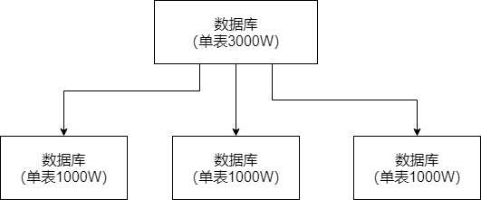
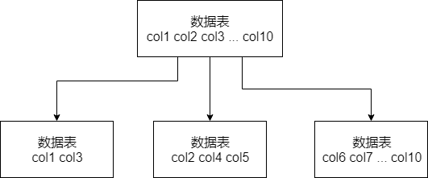

## 分库分表

​		分库分表是两回事，可能是光分库不分表，也可能是光分表不分库，都有可能。

### 分表

​		如果你单表都几千万数据了，**单表数据量太大，会极大影响你的Sql执行的性能**，到了后面sql可能就跑的很慢了。一般来说，单表到了几百万的时候，性能就会相对差一些，你就得分表了。

​		分表，就是把一个表的数据放到多个表中，然后查询的时候你就查一个表。比如按照用户ID来分表，将一个用户的数据就放在一个表中。然后操作的时候你对一个用户就操作那个表就可以了。这样可以控制每个表的数据量在可控的方范围内，比如每个表就固定在200万以内。

### 分库

​		分库，就是一般而言我们一个库，最多支撑到2000并发，就一定要扩容了，而且一个健康的单库并发值最好保持在每秒1000左右，不要太大。可以将一个库的数据拆分到多个库中，访问的时候就访问一个库好了。

|              | 分库分表前                  | 分库分表后                                   |
| ------------ | --------------------------- | -------------------------------------------- |
| 并发支撑情况 | MySQL单机部署，扛不住高并发 | MySQL从单机到多机，能承受的并发增加了多倍    |
| 磁盘使用情况 | MySQL单机磁盘容量几乎撑满   | 拆分为多个库，数据库服务器磁盘使用率大大降低 |
| SQL执行性能  | 单表数据量太大，SQL越跑越慢 | 单表数据库量减少，SQL执行效率明显提升        |

### 分库分表的中间件

​		比较常见的分库分表的中间件包括：

Cobar

TDDL

Atlas

Sharding-jdbc

Mycat

​        目前市场上比较主流的就是sharding-jdbc和Mycat，这两个都可以考虑去使用。Sharding-jdbc这种属于Client层方案，**优点在于不用部署，运维成本低，不需要代理层的二次转发请求，性能很高**，但是如果遇到升级啥的需要各个系统都重新升级版本再发布，各个系统都需要**耦合**Sharding-jdbc的依赖。Mycat属于proxy层方案，缺**点在于需要部署**，自己运维一套中间件，运维成本高，但是好处在于对于各个项目是透明的，如果遇到升级之类的都是自己中间间那里处理即可。

​		通常来说，这两个方案其实都可以选用，但是大佬建议中小型公司选用 Sharding-jdbc，client 层方案轻便，而且维护成本低，不需要额外增派人手，而且中小型公司系统复杂度会低一些，项目也没那么多；但是中大型公司最好还是选用 Mycat 这类 proxy 层方案，因为可能大公司系统和项目非常多，团队很大，人员充足，那么最好是专门弄个人来研究和维护 Mycat，然后大量项目直接透明使用即可。

### 如何对数据库进行水平拆分和垂直拆分

#### 水平拆分

​		水平拆分，就是把一个表的数据弄个多个库的多个表里去，但是每个库的表结构都一样，只不过每个库表放的数据是不同的，所有库表的数据加起来就是全部数据。水平拆分的意义，就是将数据均匀放更多的表里，然后用多个库来抗更高的并发，还有就是用多个库的存储容量来进行扩容。

#### 垂直拆分

​		垂直拆分，就是**把一个有很多字段的表给拆分成多个表，或者是多个库上去**。每个库表的结构都不一样，每个库表都包含部分字段。一般来说，会**将较少的访问频率很高的字段放到一个表里去**，然后**将较多的访问频率很低的字段放到另一个表里去**。因为数据库是有缓存的，你访问频率高的行字段越少，就可以在缓存里缓存更多的行，性能就越好。这个一般在表层面做的较多一些。

​		还有**表层面的拆分**，就是分表，将一个表变成N个表，就是让每个表的数据量控制在一定范围内，保证SQL的性能。否则单表的数据量越大，SQL性能就越差。

​		无论分库还是分表，上面说的那些数据库中间件都是可以支持的。就是基本上那些中间件可以做到你分库分表之后，**中间件可以根据你指定的某个字段值**，比如说 userid，**自动路由到对应的库上去，然后再自动路由到对应的表里去**。

​		你就得考虑一下，你的项目里该如何分库分表？一般来说，垂直拆分，你可以在表层面来做，对一些字段特别多的表做一下拆分；水平拆分，你可以说是并发承载不了，或者是数据量太大，容量承载不了，你给拆了，按什么字段来拆，你自己想好；分表，你考虑一下，你如果哪怕是拆到每个库里去，并发和容量都 ok 了，但是每个库的表还是太大了，那么你就分表，将这个表分开，保证每个表的数据量并不是很大。

​		有两种分库分表的方式：

- 按照range来分，就是每个库一段连续的数据，这个一般是按照，例如时间范围来的。但是这种一般较少使用，因为很容易产生热点问题，大量的流量都打在最新的数据上了
- 按照某个子段hash一下均匀分散，这个较为常用。

​        range来分，好处在于说，扩容的时候很简单，因为你只要预备好，给每个月都准备一个库就可以了，到了一个新的月份的时候，自然而然，就会写新的库了；缺点，但是大部分的请求，都是访问最新的数据。实际生产用 range，要看场景。

​		hash 分发，好处在于说，可以平均分配每个库的数据量和请求压力；坏处在于说扩容起来比较麻烦，会有一个数据迁移的过程，之前的数据需要重新计算 hash 值重新分配到不同的库或表。