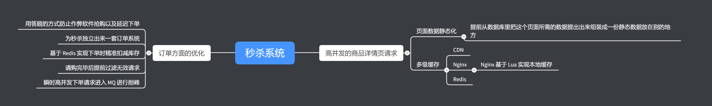
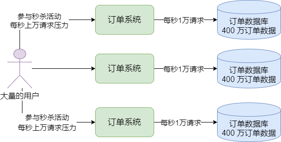
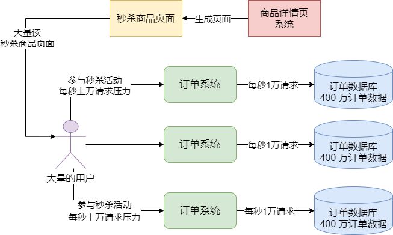
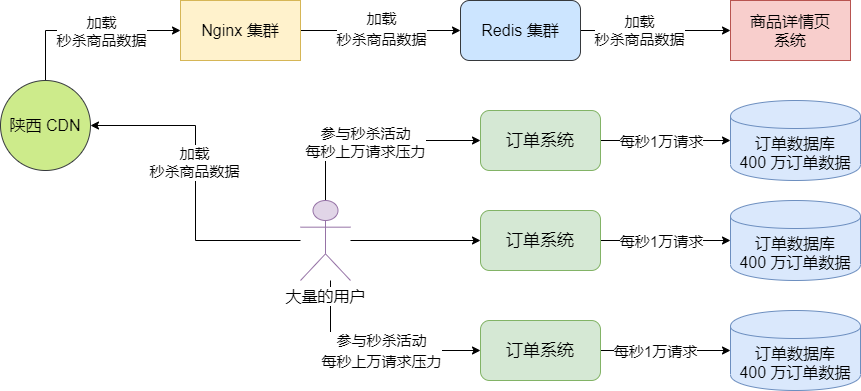
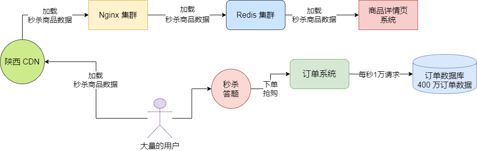
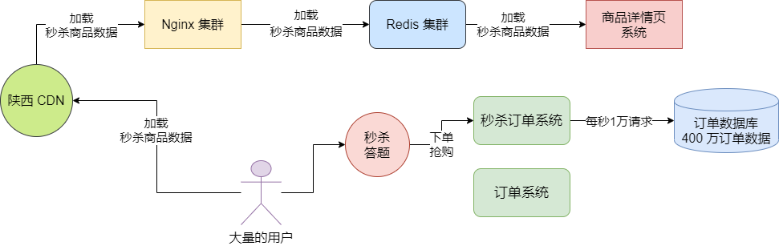
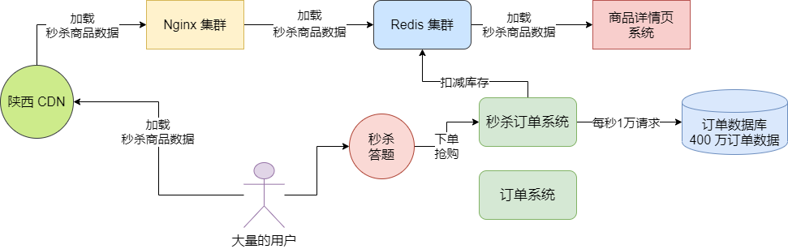
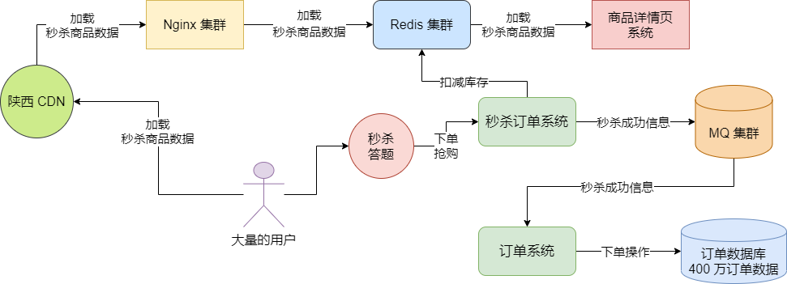

思维导图

## 秒杀活动压力过大怎么办

秒杀活动压力过大，是否能通过堆机器解决？比如说给订单系统部署更多的机器，是不是可以抗下更高的并发？这个是没问题的，订单系统可以通过部署更多的机器机型线性扩展。

那数据库呢？是否也要部署更多的服务器，进行分库分表，然后让更多的数据库服务器来抗更高的数据库高并发访问？大概思路是这样，所谓分库分表，就是把目前的一台数据库服务器变成多台数据库服务器，然后把一张订单表变成多张订单表。

例如，假设订单表里有 1200 万条数据，然后有一台数据库服务器，如果我们现在变成 3 台数据库服务器，那么可以在每台数据库服务器里放 400 万订单数据，这就是所谓的分库分表。这样的好处是什么呢？如果未来订单系统的整体访问压力达到了每秒 3 万请求了，此时订单系统通过扩容可以部署更多机器，然后其中每台数据库服务器承受 1 万的请求，如图：

这样不就可以通过增加更多的数据库服务器来抗下更高的并发请求了吗？但其实这不太靠谱。除非是技术能力比较弱的公司，没有厉害的架构师去利用已有的技术合理设计优秀的架构，才会用这种堆机器的方式简单地抗下超高的并发。

如果用堆机器的方式来解决这个问题，必然存在一个问题，就是随着你的用户量越来越大，你的并发请求越来越多，会导致你要不停地增加更多的机器。所以解决问题不能用这种简单粗暴堆机器的方案。

## 高并发的商品详情页请求

秒杀活动主要涉及到的并发压力有两块：**一个是高并发地读，一个是高并发地写。**

首先思考一下，平时大量的用户是怎么参与到秒杀活动里来的？往往是这样。假设每天晚上 8:30 有一波秒杀商品开始售卖，因为每次到了晚上 8:30 之前，就有很多用户会登陆 APP，然后再 APP 前坐等秒杀特价商品。

所以这个时候，必然会出现一种场景，就是首先大量用户会拿着 APP 不停地刷新一个秒杀商品的页面。那么这些秒杀商品页面是从哪儿加载出来的？本质上来说从商品技术团队负责的商品详情页加载出来的，如图，引入了一个商品详情页系统的概念，它负责提供我们看到的各种秒杀商品页面。

所以这个商品详情页系统就是在秒杀活动开始之前最先被大量用户高并发访问的一个系统了。如果没有秒杀活动的时候，其实大量的用户是分散在不同的时间段来逛 APP 的，并且逛的是不同的人会看不同的商品的页面。

但是在秒杀活动的时候，面临的第一个问题是，可能几十万人会同一时间频繁地访问同一个秒杀商品的页面，对商品详情页系统造成巨大的访问压力。

## 商品团队的秒杀架构优化：页面数据静态化

为了解决商品详情页系统的技术难点，一般采取的是 **页面数据静态化 + 多级缓存** 的方案。

首先第一步，秒杀商品页面必须是将其数据做到静态化，这是什么意思呢？

如果让秒杀商品页面是动态化的，那么每次一个用户只要访问这个商品详情页，就必须发送一次请求到后端的商品详情页来获取数据。比如商品的标题、副标题、价格、优惠策略、库存、大量的图片、商品详情说明。售后政策等等，这都是商品详情页的数据。

那么你可以选择让用户浏览这个秒杀商品的时候，每次都发送请求到后台去加载这些数据过来，然后渲染出来给用户看这个商品页面，这就是所谓的动态模式。

如果这商品详情页里的大量数据都是存储在商品团队里的数据库里的，那么岂不是大量用户同时频繁访问这个商品详情页，会直接导致商品详情页系统承受高并发的访问？同时导致商品数据库承受高并发的访问？

所以首先需要将这个秒杀活动的商品详情页里的数据做成静态化的，也就是提前就从数据库里把这个页面需要的数据都提取出来组装成一份静态数据放在别的地方，避免每次访问这个页面都要访问后端数据库。

## 商品团队的秒杀架构优化：多级缓存

接着就是多级缓存的架构，我们会使用 **CDN + Nginx + Redis** 的多级缓存架构。

比如说秒杀商品详情页的数据，首先会放一份在离用户地理位置比较近的 CDN 上。CDN 你大致可以这么理解，比如你们公司的机房在广州，系统也部署在广州，那么对于陕西的用户，我们可以将一份静态化好的数据放在陕西的一个 CDN 上。然后不同地方的用户在加载这个秒杀商品的详情页数据时，就是从附近的 CDN 上加载的，不需要每次请求都发送到我们公司在广州的机房去。

这个 CDN 缓存就是我们多级缓存架构里的第一级缓存。那如果因为缓存过期之类的问题，CDN 上没有用户要加载的商品详情页数据，此时用户就会发送请求到我们公司的机房里的机器上去请求加载这个商品的数据了，这个时候我们需要在 Nginx 这样的服务器里做一级缓存。

在 Nginx 中是可以基于 Lua 脚本实现本地缓存的，我们可以提前把秒杀商品详情页的数据放到 Nginx 中进行缓存，如果请求发送过来，我们可以从 Nginx 中直接加载缓存数据，不需要把请求转发到我们商品系统上去。

这个时候如果在 Nginx 服务器上也没加载到秒杀商品的数据呢？此时就可以由 Nginx 中的 Lua 脚本发送请求去 Redis 集群中加载我们提前放进去的秒杀商品数据。

如果在 Redis 中还是没有找到，那么就由 Nginx 中的 Lua 脚本直接把请求转发到商品详情页系统里去加载就可以了，此时就会直接从数据库中加载数据出来。但是一般来说数据是可以从 CDN、Nginx、Redis 中加载到的，可能只有极少的请求会直接访问到商品系统去从数据库里加载商品页数据。

通过这样的一套方案。我们就可以把用于秒杀活动的商品详情页数据进行静态化，然后把静态化以后的一串商品数据（例如 JSON 串）放到 CDN、Nginx、Redis 组成的多级缓存里去，这样大量的用户同时访问这个商品页面对我们系统本身就没什么压力了。

## 订单方面的优化

### 用答题的方式避免作弊软件抢购以及延缓下单

首先我们要防止有人写一个抢购的脚本或者作弊软件，疯狂地发送请求去抢商品，所以一般来说，现在你要参与抢购，都会让你点击按钮之后先进行答题，就是说先弹出一个框，让你回答一个问题，回答正确了你才能发起抢购的请求。

这个办法是非常有效的，因为首先它避免了一些作弊软件去发送抢购请求，另外就是不同的人答题的速度是不一样的，所以可以通过这个答题让不同的人发送请求的时间错开，不会在一个时间点发起请求。如图：

### 为秒杀独立出来一套订单系统

接着用户下单抢购的请求发送出去之后，会达到我们的后台系统，对于后台系统而言，我们需要思考，是否直接用我们目前已有的订单系统去抗所有的请求？

答案是否定的。假设你有 100 万用户在这个时间段很活跃来购买物品，但是可能只有其中 50 万用户在参与秒杀活动，同一时间发送了大量的抢购请求到后台系统，但是同时还有很多其它的用户这个时候并不在参与秒杀系统，他们在进行其它商品的常规性浏览和下单。

如果你让秒杀下单和普通下单请求都由一套订单系统来承载，那么可能会导致秒杀下单请求耗尽了订单系统的资源，或者导致系统不稳定，然后导致其他普通下单请求也出现问题，没有办法完成下单。所以我们一般会对订单系统部署两个集群，一个集群是秒杀订单系统集群，一个集群是普通订单系统集群。如图：

### 基于 Redis 实现下单时精准扣减库存

在后台系统中首先要做的一个事情，就是扣减库存。秒杀商品一般是有数量限制的，所以当大量的请求到达后台系统之后，第一步，就是先去扣减库存。

在秒杀场景下，**一般会将每个商品的库存提前写入 Redis 中**，然后当请求到来之后，就直接对 Redis 中的库存进行扣减。Redis 是可以轻松用单机抗每秒几万高并发的，因此这里就可以抗下高并发额库存扣减。比如我们总共就 1 万件秒杀商品，其实最多就是前 1 万个到达的请求可以成功从 Redis 中扣减库存，抢购到这个商品，接着后续的请求从 Redis 里扣减库存的时候，都会发现库存已经没有了，无法抢购商品了。

### 抢购完毕之后提前过滤无效请求

在 Redis 中的库存被扣减完之后，就说明后续其他的请求都没有必要发送到秒杀系统了，此时我们一颗让 Nginx 在接收到后续请求之后，直接就把后续请求过滤掉。

比如一旦商品请购完毕，可以在 ZooKeeper 中写入一个秒杀完毕的标志位，然后 ZK 会反向通知 Nginx 中我们自己写的 Lua 脚本，通过 Lua 脚本后续在请求后来的时候直接过滤掉，不要向后转发了。这样就可以最大幅度削减对后端秒杀系统的请求压力。

### 瞬时高并发下单请求进入 MQ 进行削峰

接着我们来思考下，即使是有 1 万件商品同时被 1 万人秒杀成功了，那么可能瞬间会有 1 万请求涌入正常的订单系统进行后续的处理，此时可能还是会有瞬间上万请求访问到订单数据库中创建订单。这个时候，**完全可以引入 MQ 进行削峰处理**。

对于秒杀系统而言，如果发现通过 Redis 完成了库存扣减，并且此时库存还大于 0，说明秒杀成功了需要生成订单，此时就直接发送一个消息到 MQ 中即可，然后普通订单系统熊 MQ 中消费秒杀成功的消息进行常规化的流程处理即可，比如创建订单等等。

这样的话，瞬间上万并发的压力会被 MQ 轻松抗下来，然后普通的订单系统可以根据自己的工作负载慢慢地从 MQ 中拉取秒杀成功的消息，然后进行后续操作即可，不会对订单数据造成过大的压力。否则如果你让瞬间产生的一万或者几万的订单请求直接访问订单数据库，必然还是会让它压力过大，需要额外增加机器，这就没有必要了。

因此这里利用 MQ 抗下每秒几万并发的下单请求，然后让订单系统已每秒几千的速率慢慢处理即可，也就是延迟可能几十秒，这些下单请求就会处理完毕。如图：

## 秒杀架构的核心要点

通过这篇文章的思路，就会清晰地看到，对于一个秒杀系统而言，比较重要的一下几点：

- 在前端/客户端通过设置秒杀答题，错开大量下单的时间，组织作弊器刷点

- 独立出来一套秒杀系统，专门负责处理秒杀请求

- 优先基于 Redis 进行高并发的库存扣减，一旦库存扣减完则秒杀结束

- 秒杀结束后，Nginx 层过滤掉无效的请求，大幅度削减转发到后端的流量

- 瞬时生成的大量下单请求直接进入 MQ 进行削峰，订单系统慢慢拉取消息完成下单操作

