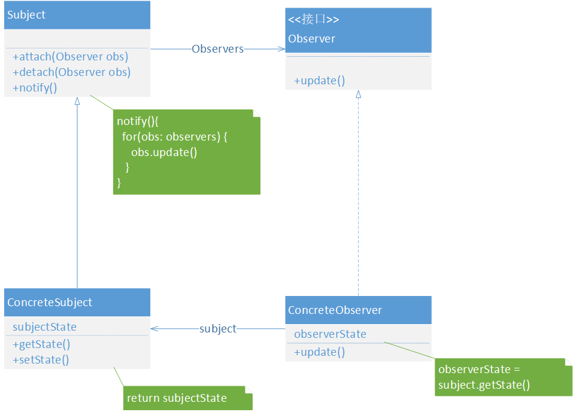
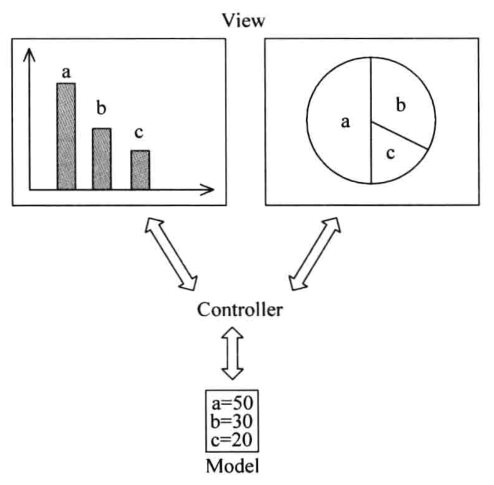
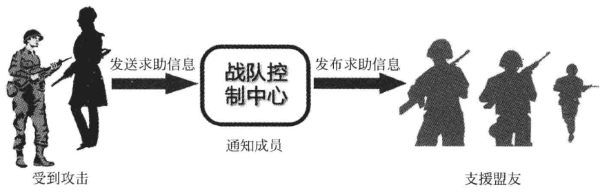
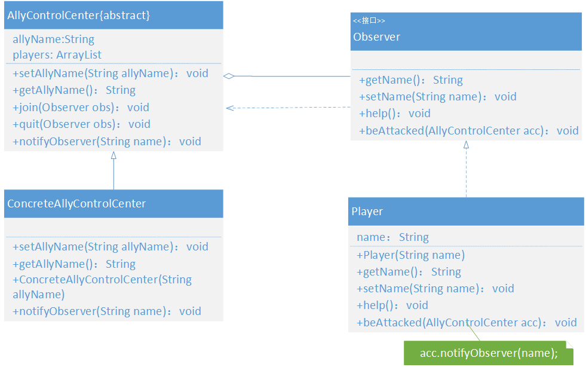

​		“红灯停，绿灯行”。在这个过程中，信号灯是汽车的观察目标，汽车是观察者。随着信号灯的变化，汽车的行为也随着变化。在软件系统中，一个对象的状态或行为的变化将导致其他对象的行为或状态也发生改变，它们之间将产生联动。为了更好地描述对象之间存在的这种一对多（包括一对一）的联动，观察者模式应运而生。

​		观察者模式是使用频率最高的设计模式之一，用于建立一种对象与对象之间的依赖关系，一个对象发生改变时将自动通知其他对象，其他对象将相应作出反应。在观察者模式中，发生改变的对象成为观察目标，而被通知的对象成为观察者。这些观察者之间可以没有任何相互联系，可以根据需要增加和删除观察者，使得系统更易于扩展。

## 观察者模式定义：

观察者模式：定义对象之间的一种一对多依赖关系，使得每当一个对象状态发生改变时，其相关依赖对象皆得到通知并被自动更新。观察者模式的别名包括发布-订阅（Publish/Subscribe）模式、模型-视图（Model/View）模式、源-监听器（Source/Listener）模式或从属者（Dependents）模式。观察者模式是一种对象行为型模式。

## 观察者模式结构图：

在结构图中包含以下四个角色：

（1）**Subject（目标）**：目标又称为主题，它是指被观察的对象。在目标中定义了一个观察者集合，一个观察目标可以接受任意数量的观察者来观察，它提供一系列方法来增加和删除观察者对象，同时定义了通知方法notify()。目标类可以是接口，也可以是抽象类或具体类。

（2）**ConcreteSubject（具体目标）**：具体目标是目标类的子类，通常包含有经常发生改变的数据，当他的状态改变时，向其各个观察者发出通知；同时它还实现了在目标类中定义的抽象业务逻辑方法（如果有的话）。如果无须扩展目标类，则目标具体类可以省略。

（3）**Observer（观察者）**：观察者将对观察目标的改变做出反应，观察者一般定义为接口，改接口声明了更新数据的方法update()，因此又称为抽象观察者。

（4）**ConcreteObserver（具体观察者）**：在具体观察者中维护一个指向具体目标对象的引用，它存储具体观察者的有关状态，这些状态需要和具体目标的状态保持一致。它实现了在抽象观察者Observer中声明的update()方法。通常在实现时，可以调用具体的目标类的attach()方法将自己添加到目标类的集合或通过detach()方法将自己从目标类的集合中删除。

## 观察者模式主要优缺点：

### 1、主要优点

（1）观察者模式可以实现表示层和数据逻辑层的分离，定义了稳定的消息更新传递机制，并抽象了更新接口，使得可以有各种各样不同的表示层充当具体观察者角色。

（2）观察者模式在观察目标和观察者之间建立一个抽象的耦合。观察目标只需要维持一个抽象观察者的集合，无须了解其具体观察者。由于观察目标和观察者没有紧密地耦合在一起，因此它们可以不同的抽象化层次。

（3）观察者支持广播通信，观察目标会向所有已注册的观察者对象发送通知，简化了一对多系统设计的难度。

（4）观察者模式满足开闭原则的要求，增加新的具体观察者无须修改原有系统代码，在具体观察者与观察目标之间不存在关联关系的情况下，增加新的观察目标也很方便。

### 2、主要缺点

（1）如果一个观察目标对象有很多直接或间接观察者，将所有的观察者都通知到会花费很多时间

（2）如果在观察者和观察目标之间存在循环依赖，观察目标会触发它们之间进行循环调用，可能导致系统崩溃。

（3）观察者模式没有相应的机制让观察者知道所观察的目标是怎么发生变化的，而仅仅只是知道观察目标发生了变化。

## 观察者模式使用场景：

（1）一个抽象模型有两个方面，其中一个方面依赖于另一个方面，将这两个方面封装在独立的对象中使它们可以各自独立地改变和复用。

（2）一个对象的改变将导致一个或多个其他对象也发生改变，而并不知道具体有多少对象将发生改变，也不知道这些对象是谁。

（3）需要在系统中创建一个触发链，A对象的行为将影响B对象，B对象的行为将影响C对象......，可以使用观察者模式创建一种链式触发机制。

## 观察者模式与MVC的关系：

​		MVC是一种架构模式，它包含3个角色：模型（Model）、视图（View）和控制器（Controller）。其中，模型可应对于观察者模式中的观察目标，而视图对应于观察者，控制器可充当两者之间的中介者，当模型层的数据发生改变时，视图层将自动显示内容。

## 案例

​		Sunny软件公司欲开发一款多人联机对战游戏（类似魔兽世界），在该游戏中，多个玩家可以加入同一战队组成联盟，当战队中某一成员受到敌人攻击时将给所有其他盟友通知，盟友收到通知后将做出响应。

​		Sunny公司通过对系统功能需求进行分析，发现在改系统中战队成员之间的联动过程可以简单描述如下：**联盟成员受到攻击-->发送通知给盟友-->盟友做出响应**。如果按照此思路来设计系统，因为成员在受到攻击时需要通知他的每位盟友，所以每个成员都需要持有其他所有盟友的信息，这将导致系统开销较大。因此开发人员决定引入一个新的角色--“战队控制中心”来负责维护和管理每个战队所有成员的信息。当一个成员受到攻击时，向相应的战队控制中心发送求助信息，战队控制中心再逐一通知每个盟友，盟友再做出相应。如图所示：

为了实现对象之间的联动，Sunny公司决定使用观察者模式来进行多人联机对战游戏的设计，其基本结构图如图所示：

相关[代码](https://github.com/GD-CKING/Design-Pattern/tree/master/Observer-Pattern/code)实现已上传

