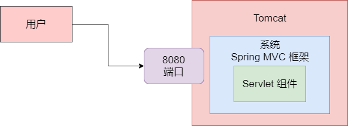
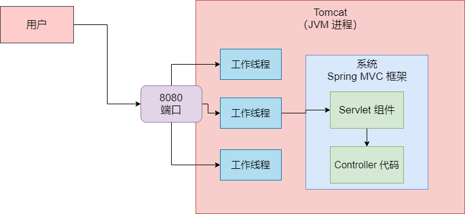
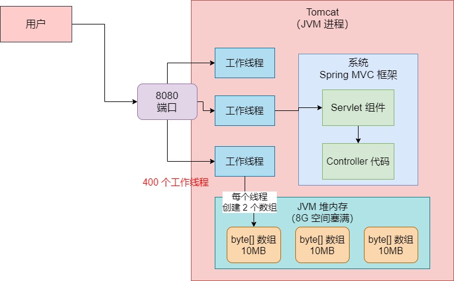
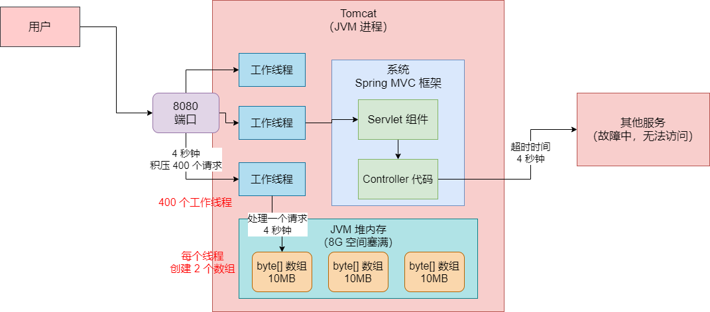

由此系统因为 OOM 问题而挂掉了，当时我们就登录到线上系统去下载日志，并在日志中发现类似这么一句话：

```verilog
Exception in thread "http-nio-8080-exec-1089" java.lang.OutOfMemoryError: Java heap space
```


日志中，`http-nio-8080-exec 1089` 说的其实是 Tomcat 的工作线程，而后面的 `java.lang.OutOfMemoryError: Java heap space` 指的就是堆内存溢出的问题，所以连起来看，这段日志的意思是 Tomcat 的工作线程在处理请求的时候需要在堆内存里分配对象，但是发现堆内存塞满了，而且根本没办法回收多余的对象，堆内存已经放不下更多对象了，就报了这个异常。


### 简单说说 Tomcat 的底层原理

讲到这，我们看看 Tomcat 的基本工作原理，以及发生这个 OOM 异常的基本原因。首先，我们写的系统一般都是部署在 Tomcat 中的。最早我们会在 Eclipse / IDEA 开发工具上写一堆 Servlet，然后打包放入 Tomcat，再启动 Tomcat。接着我们访问 Tomcat 监听的一个端口号（一般是 8080），然后系统的功能就可以运行起来了。


后来随着技术的发展，我们不再写 Servlet 这么原始的东西，有一些类似 Spring MVC 之类的框架把 Servlet 封装起来，我们就基于 Spring MVC 之类的框架去开发。再后面，出现了 SpringBoot，我们可以把 Tomcat 之类的 Web 容器都内嵌在系统里。


Tomcat 会监听一个默认的 8080 端口号，然后我们就通过浏览器可以对这个机器上的 Tomcat 发起请求，类似下面的请求：

```http
http://192.168.200.15:8080/order?userid=100
```


接着 Tomcat 会监听 8080 端口收到这个请求，通常来说它会把请求交给 Spring Web MVC 之类的框架去处理，这类框架一般底层都封装了 Servlet / Filter 之类的组件，它也是用这类组件去处理请求的，如图：




然后类似 Spring MVC 的框架的 Servlet 组件，就会根据你的请求路径，比如 `/order` 这种东西，去找到你代码中用来处理这个请求的 Controller 组件。那我们来思考一个问题，Tomcat是个什么东西？


如果我们是把写好的系统放入 Tomcat 目录中，然后启动 Tomcat，此时我们启动的 Tomcat 本身就是一个 JVM 进程，因为 Tomcat 自己也是 Java 写的。所以要明确一个概念，就是 T**omcat 自己就是一个 JVM 进程**，我们写好的系统只不过是一些代码而已，这些代码时一个一个的类，这些类被 Tomcat 加载到内存里去，然后由 Tomcat 来执行我们写的类。


既然如此，Tomcat 本身是如何去监听 8080 端口上收到的请求？其实，Tomcat 有自己的工作线程，大家要对 Tomcat 的工作线程这个概念有一个认识，即 Tomcat 有很多自己的工作线程，少则一两百个，多则三四百个也是可以的。


然后从 8080 端口上收到的请求都会均匀地分配给这些工作线程去处理，而这些工作线程收到请求之后，就负责调用 Spring MVC 框架的代码，Spring MVC 框架有负责调用我们自己写的代码，比如 Controller 之类的。所以最终运行起来原理如下图：




### 再回顾异常日志

接着我们回过头看当时在线上系统的日志中发现的异常：

```verilog
Exception in thread "http-nio-8080-exec-1089" java.lang.OutOfMemoryError: Java heap space
```


这个时候理解起来就很简单了，`http-nio-8080-exec-1089` 这个说白了就是上图中的 Tomcat 工作线程，因为它是负责调用 Spring MVC 以及我们写的 Controller、Service、DAO 等一大堆的代码的，所以它发现运行的时候堆内存不够了，就会抛出堆内存溢出的异常了。


### 一个关键的 JVM 参数

一旦我们发现线上系统发生了内存溢出的异常，第一步是看日志，具体看两点：

看是堆内存溢出，还是栈内存溢出，或者是 Metaspace 内存溢出。首先得确定一下具体的溢出类型

看是哪个线程代码运行的时候内存溢出了，因为 Tomcat 运行的时候不光有自己的工作线程，我们写的代码也可能创建一些线程出来


看完这两个东西之后，就得记得每个系统上线，必须设置一个参数：`-XX:+HeapDumpOnOutOfMemoryError`。这个参数会在系统内存溢出的时候导出来一份内存快照到我们指定的位置，接着排查和定位内存溢出问题，主要就得依托这个自动导出来的内存快照了。


### 对内存快照进行分析

一般我们都是用 MAT 来分析内存快照，主要就是通过 MAT 来找到那些占据内存最大的对象。


通过内存快照分析我们发现占据内存最大的是大量的 `byte[]` 数组，一大堆 byte[]  数组就占据了大约 8G 左右的内存空间，而我们当时线上机器给 Tomcat 的 JVM 堆内存分配的也就是 8G 左右的内存而已。因此我们可以直接得出第一个结论：Tomcat 工作线程在处理请求的时候会创建大量的 byte[] 数组，大约有 8G 左右，直接把 JVM 堆内存占满了。


接着我们想知道到底是哪些 byte[] 数组在这里，因此我们通过 MAT 深入查看，发现大概是类似下面的一大堆 byte[] 数组：

- byte[10008192] @ 0x7aa800000 GET /order/v2 HTTP/1.0-forward...

- byte[10008192] @ 0x7aa800000 GET /order/v2 HTTP/1.0-forward...
- byte[10008192] @ 0x7aa800000 GET /order/v2 HTTP/1.0-forward...


当时看到了很多类似这样的数组，而且数组大小都是一致的 10MB，大概清点了一下，类似上面那样的数据，大概有 800 个左右，也就对应了 8G 的空间。


那这些数组时谁创建的？我们在 MAT 上可以继续查看一下这个数组时谁引用的，大致可以发现是 Tomcat 的类引用的，具体来说是类似下面这个类：

```java
org.apache.tomcat.util.threads.TaskThread
```


这个一看就是 Tomcat 自己的线程类，因此可以认为是 Tomcat 的线程创建了大量的 byte[] 数组，占据了 8G 的内存空间。


而我们发现 Tomcat 的工作线程大致有 400 个左右，也就是说每个 Tomcat 的工作线程都会创建 2 个 byte[] 数组，每个 byte[] 数组是 10MB 左右，最终就是 400 个 Tomcat 工作线程同时在处理请求，结果创建出来了 8G 内存的 byte[] 数组，进而导致了内存溢出。如图：




### 系统每秒的 QPS

根据上面的分析，有可能一秒钟之内瞬间来了 400 个请求，导致 Tomcat 的 400 个工作线程全部上阵处理，每个工作线程在处理一个请求的时候，会创建 2 个数组，每个数组是 10MB，结果导致瞬间让 8G 的内存空间被占满。


但我们检查了系统的监控，发现每秒的请求并不是 400，而是 100。那么出现这种情况只有一种可能，就是每个请求处理需要 4 秒钟的时间。如果每秒来 100 个请求，但是每个请求处理完毕需要 4 秒钟的时间，那么在 4 秒内会导致有 400 个请求同时在处理，也就会导致 Tomcat 的 400 个工作线程都在工作，接着就会导致上述的情况。


另外，为什么 Tomcat 工作线程在处理一个请求的额时候会创建 2 个 10MB 的数组？通过检查 Tomcat 的配置文件，发现了一个配置 `max-http-header-size: 10000000`。有了这个东西，导致 Tomcat 工作线程在处理请求的时候会创建 2 个数组，每个数组的大小如上面配置就是 10MB。


### 为什么处理一个请求需要 4 秒钟

为什么处理一个请求需要 4 秒钟。经过咨询得知这个问题是偶发性，不是每次处理请求都这样，平时处理一个请求也就几百毫秒的时间而已。这样就只能在日志里去找问题了，继续翻看事故发生的日志，发现日志中除了 OOM 以外，还有大量的服务请求超时的异常，类似下面：

```verilog
Timeout Exception....
```


即，我们系统在调用其他系统的时候出现了大量的请求超时，看了一下调用超时的配置，发现负责这个系统的工程师将服务调用超时的时间设置为了刚好是 4 秒！也就是说，在这个时间里，远程服务自己故障了，导致我们的系统调用其他服务的时候是访问不通的，然后就会在配置好的 4 秒超时时间之后抛出异常，在这 4 秒钟内，工作线程会直接卡死在无效的网络访问上。




上图可以清楚看到，之所以每个请求需要处理 4 秒钟，是因为下游服务故障了，网络请求都是失败的，此时会按照设置好的 4 秒钟时间一直卡住 4 秒之后才会抛出 Timeout 异常，然后请求处理结束。这就是一个请求处理需要 4 秒钟的根本原因，进而导致 100 个请求的压力下，4 秒内积压 400 个请求同时在处理，导致 400 个工作线程创建了 800 个数组，每个数组 10MB 内存，耗尽了 8G 的内存，最终导致内存溢出。


### 对系统进行优化

要解决上述问题，分析清楚原因之后，对症下药即可。


最核心的问题就是那个超时时间设置太长了，因此将超时时间改为 1 秒即可。这样的话，每秒 100 个请求过来，也就只有 200 个数组，占据 2G 内存，远远不会把堆内存塞满，然后 1 秒内这 100 个请求会全部超时，请求就处理结束了。下一秒再来 100 个请求又是新的一轮处理，不会每秒积压 100 个请求，4 秒积压 400 个请求同时处理了


另外，对 Tomcat 的那个参数，max-http-header-size，可以适当调节地小一些就可以了，这样 Tomcat 工作线程自身为请求创建的数组，不会占据太大的内存空间的。