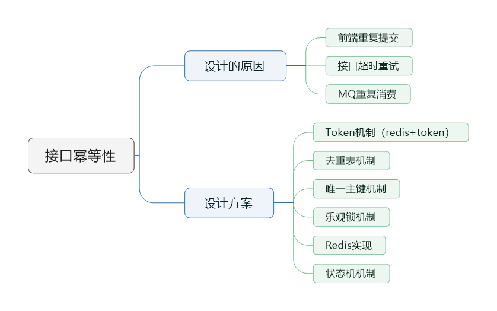
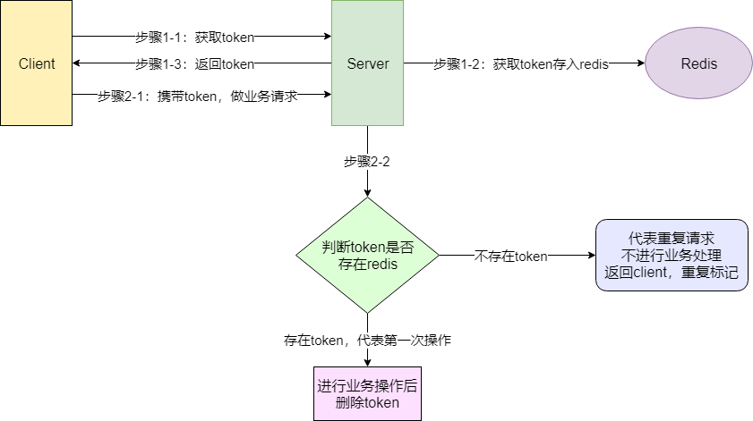
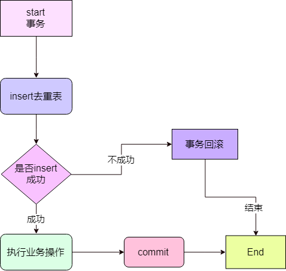

> 本节思维导图



​		在分布式系统中，一般都会有重试机制。但重复机制又有一定几率出现重复的数据。例如订单系统消费了消息，但是由于网络等问题消息系统未收到反馈是否已成功处理，此时消息系统会根据配置的规则隔断时间就retry一次。但如果此时网络恢复正常，我第一次收到的消息成功处理了，这是又收到一条消息，如果没有防护措施，就有可能出现重复数据。

## 接口幂等性

​		幂等性指**任意多次执行所产生的影响均与一次执行的影响相同**。**多次调用对系统的产生的影响是一样的，即对资源的作用是一样的，但是返回值允许不同。**在我们编程中主要操作就是CURD，其中读取（Retrieve）操作和删除（Delete）操作是天然幂等的，受影响的就是创建（Create）、更新（Update）。

对于业务中需要考虑幂等性的地方一般都是接口的重复请求，重复请求是指同一个请求因为某些原因被多次提交。导致这个情况会有几种场景：

- **前端重复提交**：提交订单，用户快速重复点击多次，造成后端生成多个内容重复的订单。
- **接口超时重试**：对于给第三方调用的接口，为了防止网络抖动或其他原因造成请求丢失，这样的接口一般都会设计成超时重试多次。
- **消息重复消费**：MQ消息中间件，消息重复消费。

## 幂等性实现方式

### Token机制



1. 服务端提供了发送token的接口，我们在分析业务的时候，哪些是存在幂等问题的，就必须在执行业务前，前去获取token，服务器会把token保存到redis中；
2. 然后调用业务接口请求时，把token携带过去，一般反正请求头部；
3. 服务器判断token是否存在redis中，存在表示第一次请求，可以继续执行业务，业务完成后，**需要把redis中的token删掉**；
4. 如果判断token不存在redis中，就表示是重复操作，直接返回重复标记给client，这样就保证了业务代码，不被重复执行。

这就是token+redis的幂等方案。适用于绝大部分场景。主要针对前端重复连续多次点击的情况，网上也有另一个版本的Token方案，不同的地方是：**网上方案检验token存在后，就立刻删除token，再进行业务处理**。而上面的方式是检验token存在后，先进行业务处理，再删除token。

网上方案的缺点是**先删除token**，这是出现系统问题导致**业务处理出现异常**，业务处理没有成功，接口调用方也没有获取到明确的结果，然后**进行重试，但token已经删除掉了**，服务端判断token不存在，**认为是重复请求，就直接返回了**，无法进行业务处理了。

而上面的方案**后删除token**也是会存在问题的，如果进行业务处理成功后，删除redis中的token失败了，这样就导致了有可能会发生重复请求，因为token没有被删除。

#### token机制缺点

**业务请求每次请求，都会有额外的请求（一次获取token请求、判断token是否存在的业务）**。其实真实的生产环境中，**1万请求也许只会存在10个左右的请求会发生重试**，为了这10个请求，我们让**9990个请求都发生了额外的请求**。（当然redis性能很好，耗时不会太明显）

### 去重表机制

往去重表里插入数据的时候，利用数据库的唯一索引特性，保证唯一的逻辑。唯一序列号可以是一个字段，也可以是多字段的唯一性组合。



这里要注意的是，**去重表和业务表应该在同一库中**，这样就保证了在同一个事务，即使业务操作失败了，也会把去重表的数据回滚。**这个很好的保证了数据一致性**。

另外，使用数据库防重表的方式它有个严重的缺点，那就是系统容错性不高，如果幂等表所在的数据库连接异常或所在的服务器异常，则会导致整个系统幂等性校验出问题。

### 乐观锁机制

乐观锁解决了计算赋值型的修改场景。例如：

```mysql
update user 
set point = point + 20, version = version + 1
 where
userid=1
 and
 version=1
```

加上了版本号后，就让此计算赋值型业务，具备了幂等性。

#### 乐观锁缺点

在操作业务前，需要先查询出当前的version版本。

### 唯一主键机制

这个机制是**利用了数据库的主键唯一约束的特性**，解决了在**insert场景**时幂等问题。但主键的要求不是自增的主键，这样就需要业务**生成全局唯一**的主键，之前老顾的文章也介绍过**分布式唯一主键ID**的生成，可自行查阅。如果是**分库分表场景下**，**路由规则要保证相同请求下**，**落地在同一个数据库和同一表中**，要不然**数据库主键约束就不起效果**了，因为是不同的数据库和表主键不相关。因为对主键有一定的要求，这个方案就跟业务有点耦合了，**无法用自增主键了**。

### Redis实现

Redis实现的方式就是将唯一序列号作为Key，唯一序列号可以拿几个字段MD5加密生产的密文，value可以是你想填的任何信息。唯一序列号也可以是一个字段，例如订单的订单号，也可以是多字段的唯一性组合。当然这里需要设置一个 key 的过期时间，否则 Redis 中会存在过多的 key。

### 状态机

对于很多业务有一个业务流转状态的，每个状态都有前置状态和后置状态，以及最后的结束状态。例如流程的待审批，审批中，驳回，重新发起，审批通过，审批拒绝。订单的待提交，待支付，已支付，取消。

以订单为例，已支付的状态的前置状态只能是待支付，而取消状态的前置状态只能是待支付，通过这种状态机的流转我们就可以控制请求的幂等。

```java
public enum OrderStatusEnum {

    UN_SUBMIT(0, 0, "待提交"),
    UN_PADING(0, 1, "待支付"),
    PAYED(1, 2, "已支付待发货"),
    DELIVERING(2, 3, "已发货"),
    COMPLETE(3, 4, "已完成"),
    CANCEL(0, 5, "已取消"),
    ;

    //前置状态
    private int preStatus;

    //状态值
    private int status;

    //状态描述
    private String desc;

    OrderStatusEnum(int preStatus, int status, String desc) {
        this.preStatus = preStatus;
        this.status = status;
        this.desc = desc;
    }

    //...
}
```

假设当前状态是已支付，如果支付接口又收到了支付请求，则会抛出异常会拒绝此处处理。

## 参考资料

https://juejin.im/post/5ceb4c4f51882572a206d174

https://juejin.im/post/5d1e01aaf265da1bbc6ff400