## Read Committed（读已提交）隔离级别

现在我们讲讲基于 ReadView 机制是如何实现 Read Committed 隔离级别的。所谓的Read Committed 隔离级别，简称为 `RC`，是说你事务运行期间，只要别的事务修改数据还提交了，你就是可以读到人家修改的数据的，所以是会发生不可重复读的问题，包括幻读的问题，都会有的。

而 ReadView 机制，它是基于 undo log 版本链条实现的一套读视图机制，它是说你事务生成一个 ReadView，如果是你事务自己更新的数据，自己是可以读到的；或者是在你生成 ReadView 之前提交的事务修改的值，也是可以读取到的。

但是如果是你生成 ReadView 的时候就已经活跃的事务，在你生成 ReadView 之后修改了数据，接着提交了，此时你是读不到的；或者是你生成 ReadView 以后再开启的事务修改了数据，还提交了，此时也是读不到的。

那么 ReadView 机制如何实现 RC 隔离级别呢？其实这里的一个非常核心的要点在于，**当你一个事务设置他处于RC隔离级别的时候，他是每次发起查询，都重新生成 一个ReadView**

举个例子，我们的数据库里有一行数据， 是事务 id = 50 的一个事务之前就插入进去的，然后活跃着两个事务，一个是事务 A （id = 60） ，一个是事务 B（id = 70）

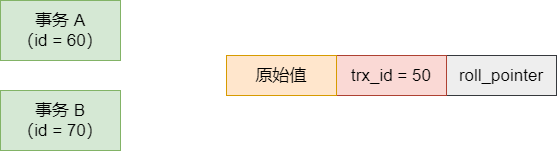

现在事务 B 发起来一次 update 操作，把这条数据的值修改为了 B，所以此时数据的 trx_id 会变为事务 B 的 id= 70，同时会生成一条 undo log，由 roll_pointer 来指向：

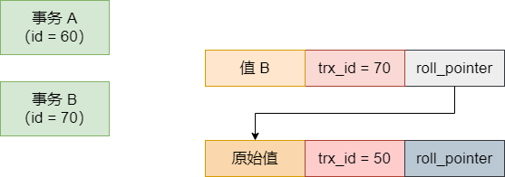

此时，事务 A 要发起一次查询操作，此时它一发起查询操作，就会生成一个 ReadView，此时 ReadView 里的 min_trx_id = 60，max_trx_id = 71，creator_trx_id = 60

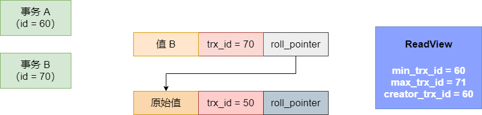

这个时候事务 A 发起查询，发现当前这条数据的 trx_id 是 70，即属于 ReadView 的事务 id 范围之间，说明是它生成 ReadView 之前就有这个活跃的事务，是这个事务修改了这条数据的值，但是此时事务 B 还没提交，所以 ReadView 的 m_ids 活跃事务列表里，是有 [60, 70] 两个 id 的，所以根据 ReadView 的机制，此时事务 A 是无法查到事务 B 修改的值 B 的。

接着就顺着 undo log 版本链条往下查找，就会找到一个原始值，发现它的 trx_id 是 50，小于当前 ReadView 里的 min_trx_id，说明是它生成 ReadView 之前，就有一个事务插入了这个值并且早就提交了，因此可以查到这个原始值。如下图：

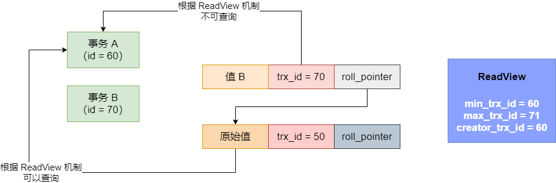

接着，假设事务 B 此时就提交了，好，那么提交了就说明事务 B 不会活跃于数据库里了，是不是？大家要记住，事务 B 现在提交了，那么按照 RC 隔离级别的定义，事务 B 此时一旦提交，说明事务 A 下次再查询，就可以读到事务 B 修改过的值了，因为事务 B 提交了

那么怎么让事务 A 能够读到提交的事务 B 修改过的值呢？其实就是让事务 A 下次发起查询，再次生成一个 ReadView。此时再次生成 ReadView，数据库内活跃的事务只有事务 A 了，因此 min_trx_id 是 60，max_trx_id 是 71，但是 m_ids 这个活跃事务列表里，只会有一个 60 了，事务 B 的事务 id = 70 不会出现在 m_ids 活跃事务列表里了，如图：

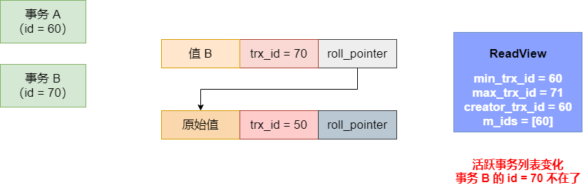

此时事务 A 再次基于这个 ReadView 去查询，会发现这条数据的 trx_id = 70，虽然在 ReadView 的 min_trx_id 和 max_trx_id 范围之间，但是此时并不在 m_ids 列表内，说明事务 B 在生成本次 ReadView 之前就已经提交了。那么既然在生成本次 ReadView 之前，事务 B 就已经提交了，就说明这次你查询就可以查到事务 B 修改过的这个值了，此时事务 A 就会查到值 B

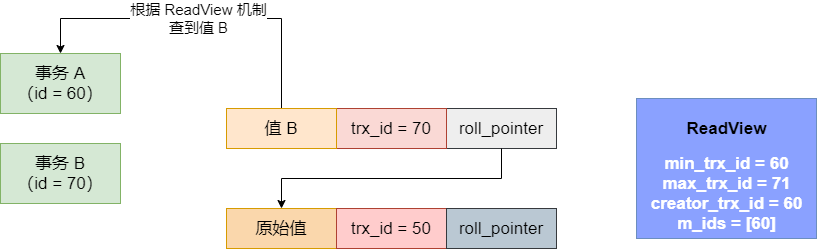

现在，RC 隔离级别如何实现的，现在应该清楚了，它的关键点在于每次查询都生成新的 ReadView，俺么如果在你这次查询之前，有事务修改了数据还提交了，你这次查询生成的 ReadView 里，那个 m_ids 列表当然不包含这个已经提交的事务了。既然不包含已经提交的事务了，那么当然可以读到人家修改过的值了

实际上，基于 undo log 多版本链条以及 ReadView 机制实现的多事务并发执行的 RC 隔离级别、RR（可重复读）隔离级别，就是数据库的 MVCC 多版本并发控制机制。

## Read Repeatable（可重复读）隔离级别

现在我们讲讲 MySQL 中的 RR（Read Repeatable 可重复读）隔离级别，是如何同时避免不可重复读问题和幻读问题的。

在 MySQL 中让多个事务并发执行的时候能够相互隔离，避免同时读写一条数据的时候有影响，是依托 undo log 版本链条和 ReadView 机制来实现的。而 RR 级别，就是你这个事务读一条数据，无论读多少次，都是一个值，别的事务修改数据之后哪怕提交了，你也是看不到人家修改的值的，这就避免了不可重复读的问题。

同时如果别的事务插入了一些新的数据，你也是读不到的，这样你就可以避免幻读问题。

那么如何实现？举个例子，假设有一条数据是事务 id = 5 的一个事务插入的，同时此时有事务 A 和事务 B 同时在运行，事务 A 的 id 是 60， 事务 B 的 id 是70

这个时候，事务 A 发起了一个查询，它就是第一次查询会生成一个 ReadView，此时 ReadView 里的 creator_trx_id 是 60，min_trx_id 是 60， max_trx_id 是 71， m_ids 是 [60, 70]。如图：

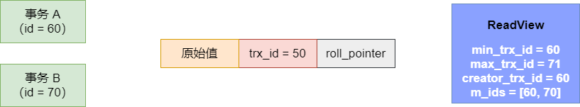

这是时候事务 A 基于这个 ReadView 去查这条数据，会发现这条数据的 trx_id 为 50，是小于 ReadView 里的 min_trx_id 的，说明它发起查询之前，早就有事务插入这条数据还提交了，所以此时可以查到这条原始数据的。如图：

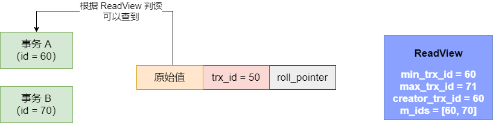

接着事务 B 此时更新了这条数据的值为值 B，此时会修改 trx_id 为 70，同时生成一个 undo log，而且关键是事务 B 此时还提交了，也就是说此时事务 B 已经结束了

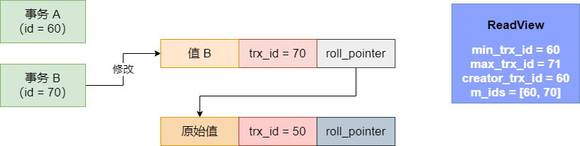

此时，ReadView 中的 m_ids 此时还会是 60 和 70 吗？那必然是的，因为 ReadView 一旦生成了就不会改变了，这个时候事务 B 虽然已经结束了，但是事务 A 的 ReadView 里，还是会有 60 和 70 两个事务 id。它的意思是，在你事务 A 开启查询的时候，事务 B 当时是在运行的

接着此时事务 A 去查询这条数据的值，它会发现此时数据的 trx_id 是 70 了，70 一方面是在 ReadView 的 min_trx_id 和 max_trx_id 的范围区间的，同时还在 m_ids 列表中。这说明是事务 A 开启查询的时候，id 为 70 的这个事务还是在运行的，然后又这个事务 B 更新了这条数据，所以此时事务 A 是不能查询到事务 B 更新的这个值的，因此这个时候继续顺着指针往历史版本链条上去找。

接着事务 A 顺着指针找到下面一条数据，trx_id 为 50，是小于 ReadView 的 min_trx_id，说明在它开启查询之前，就已经提交了这个事务了，所以事务 A 是可以查询到这个值的，此时事务 A 查询到的是原始值。

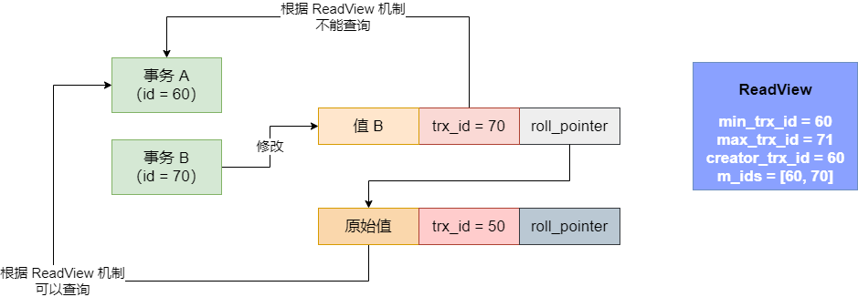

这样是不是就避免了不可重复读的问题？事务 A 多次读同一个数据，每次读到的都是一样的值，除非是它自己修改了值，否则读到的一直会一样的值。不管别的事务如何修改数据，事务 A 的 ReadView 始终是不变的，它基于这个 ReadView 始终看到的值是一样的

接着我们看幻读是怎么解决的。假设事务 A 先用 `SELECT * FROM x  WHERE id > 10` 来查询，此时可能查到的就是一条数据，而且读到的是这条数据的原始值的那个版本。

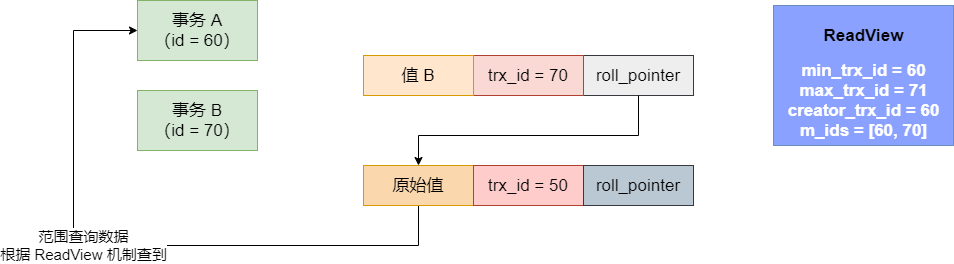

现在有一个事务 C 插入了一条数据，然后提交了

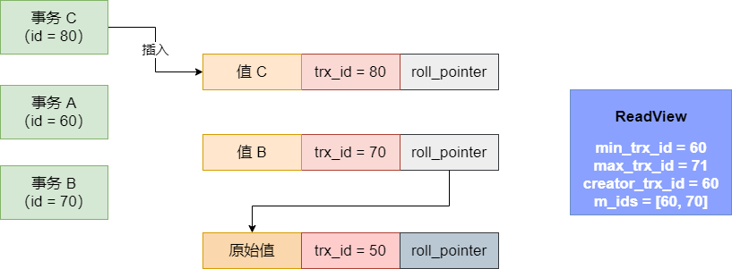

接着此时事务 A 再次查询，此时会发现符合条件的有 2 条数据，一条是原始值数据，一条是事务 C 插入的那条数据，但是事务 C 插入的那条数据是 trx_id 是 80，这个 80 是大于自己的 ReadView 的 max_trx_id 的，说明是自己发起查询之后，这个事务才启动的，所以这条数据是不能查询的

因此事务 A 本次查询，还是只能查到原始值一条数据，如图：

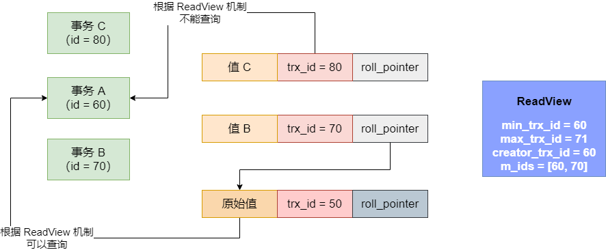

所以，事务 A 根本不会发生幻读，它根据条件范围查询的时候，每次读到的数据都是一样的，不会读到人家插入进去的数据，这都是依托 ReadView 机制实现的。

## 总结

我们简单梳理一下 MySQL 中的多事务并发运行的隔离原理，这套隔离原理，说白了就是 MVCC 机制，也就是 multi-version concurrent control，就是多版本并发控制机制

首先，多个事务并发运行的时候，同时读写一个数据，可能会出现脏写、脏读、不可重复读、幻读几个问题。

所谓脏写，就是两个事务都更新一个数据，结果有一个人回滚了把另外一个人更新的数据也回滚没了；脏读，就是一个事务读到了另外一个还没提交的时候修改的数据，结果另外一个事务回滚了，下次读就读不到了；不可重复读，就是多次读同一条数据，别的事务修改数据值还提交了，多次读到的值不同；幻读，就是范围查询，每次查询的的数据不同，有时候别的事务插入了新的值，就会读到的值不同

针对这些问题，所有才有了 RU（读未提交）、RC（读已提交）、RR（可重复读） 和串行四个隔离级别

RU 隔离级别，就是可以读到别人还没提交的事务修改过的数据，只能避免脏写问题；RC 隔离级别，可以读到人家提交的事务修改过的数据，可以避免脏写和脏读问题；RR 是不会读到别的事务已经提交事务修改的数据，可以避免脏读、脏写和不可重复读的问题；串行是让事务都串行执行，可以避免所有问题

然后 MySQL 实现 MVCC 机制的时候，是基于 **undo log 多版本链条 + ReadView 机制**来做的，默认的 RR 隔离级别，就是基于这套机制实现了 RR 级别，除了避免脏写、脏读、不可重复读，还能避免幻读问题。因此我们一般来说我们都用默认的 RR 隔离级别就可以了

