MySQL 默认的事务隔离级别是 RR（Read Repeatable 可重复读），即脏写、脏读、不可重复读、幻读都不会发生，这是怎么做到的？这就是由经典的 MVCC 多版本并发控制机制实现的。在讲解 MVCC 机制之前，我们得先讲讲 undo log 版本连。

## 理解 MVCC 机制的前奏：undo log 版本链

简单来说，我们每条数据其实都有两个子段，一个是 `trx_id`，一个是 `roll_pointer`，这个 trx_id 就是最近一次更新这条数据的事务 id，roll_pointer 就是指向你更新这个事务之前生成的 undo log。

举个例子，假设有一个事务 A（id = 50），插入了一条数据，那么此时这条数据的隐藏字段以及指向的 undo log 如下图所示，插入的这条数据的值是值 A，因为事务 A 的 id 是 50，所以这条数据的 trx_id 就是 50，roll_pointer 指向一个空的 undo log，因为之前这条数据是没有的。

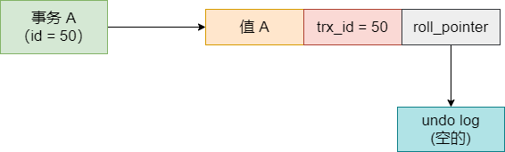

接着有一个事务 B 过来修改了这条数据，把值改成了值 B，事务 B 的 id 是 58，那么此时更新之前会生成一个 undo log 记录之前的值，然后会让 roll_pointer 指向这个实际的 undo log 回滚日志。如图：

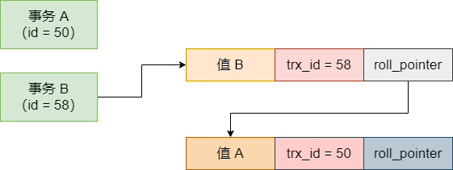

如上图 ，事务 B 修改了值为值 B，此时表里的那行数据的值就是值 B 了，那行数据的 trx_id 就是事务 B 的 id，也就是 58，roll_pointer 指向了 undo log，这个 undo log 就记录你更新之前的那条数据的值。上面 roll_pointer 指向的那个 undo log，里面的值是值 A，trx_id 是 50，因为 undo log 里记录的这个值是事务 A 插入的，所以这个 undo log 的 trx_id 就是 50。

接着事务 C 又修改了这个值为值 C，它的事务 id 是 69，此时会把数据行里的 trx_id 改成 69，然后生成一条 undo log，记录之前事务 B 修改的那个值。如下图：

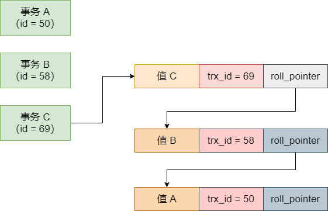

上图可以看到，数据行里的数据变成了值 C，trx_id 是事务 C 的 id，即 69，然后 roll_pointer 指向了本次修改之前生成的 undo log，也就是记录了事务 B 修改的那个值，包括事务 B 的 id，同时事务 B 修改的那个 undo log 还串联了最早事务 A 插入的那个 undo log。

总起起来，就是多个事务串行执行的时候，每个人修改了一行数据，都会更新隐藏字段 `trx_id` 和 `roll_pointer`，同时之前多个数据快照对应的 undo log，会通过 roll_pointer 指针串联起来，形成一个重要的版本链

## 基于 undo log 多本版链实现的 ReadView 机制

上面说了 undo log 多版本链，现在我们说一下这个基于 undo log 多版本链条实现的 ReadView 机制。

这个 ReadView，简单来说就是你执行一个事务的时候，就给你生成一个 ReadView，里面比较关键的东西有 4 个：

- 一个是 `m_ids`，这个就是说此时有哪些事务在 MySQL 里执行还没提交的

- 一个是 `min_trx_id`，就是 m_ids 里面最小的值

- 一个是 `max_trx_id`，就是说 MySQL 下一个要生成的事务 id，就是最大事务 id

- 一个是 `creator_trx_id`，就是你这个事务的 id

我们举个例子，让大家来理解这个 ReadView 是怎么用的。假设原来数据库里就有一行数据，很早以前就有事务插入过了，事务 id 是 32，它的值是初始值。接着，此时两个事务并发过来执行了，一个是事务 A（id = 45），一个是事务 B（id = 59），事务 B 是要去更新这样数据的，事务 A 是要读取这行数据的值的，如下图所示：

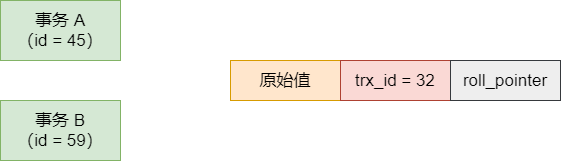

现在事务 A 直接开启一个 `ReadView`，这个 ReadView 里的 `m_ids` 就包含了事务 A 和 事务 B 的两个 id，45 和 59，然后 `min_trx_id` 就是 45，`max_trx_id` 就是 60，`creator_trx_id` 就是 45，是事务 A 自己。

这个时候事务 A 第一次查询这行数据，会走一个判断，就是判断当前这行数据的 `trx_id`是否小于 ReadView 中的 `min_trx_id`，此时发现 trx_id = 32，是小于 ReadView 里的 min_trx_id 的，说明你开启事务之前，修改这样数据的事务早就提交了，所以此时你可以查到这行数据。

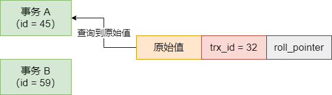

接着事务 B 开始动手了，它把这行数据的值修改为了值 B，然后这行数据的 trx_id 设置为自己的 id，同时 `roll_pointer` 指向了修改之前生成的一个 undo log，接着这个事务 B 就提交了，如下图：

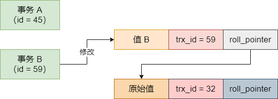

这个时候事务 A 再次查询，此时查询的时候，会发现一个问题，那就是此时数据行里的 trx_id = 59，这个 trx_id 是大于 ReadView 里的 min_trx_id（45），同时小于 ReadView 里的 max_trx_id（60）的，说明更新这条数据的事务，很可能就跟自己差不多同时开启的，于是会看一下这个 trx_id = 59，是否在 ReadView 的 m_ids 列表里？

果然，在 ReadView 的 m_ids 列表里，有 45 和 59 两个事务 id，直接证实了，这个修改数据的事务是跟自己同一时段并发执行然后提交的，所以这样数据是不能查询的。如下图所示：

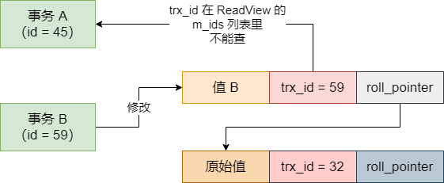

那这行数据不能查，查什么呢？简单，顺着这条数据的 roll_pointer 顺着 undo log 日志链条往下找，就会扎到最新的一条 undo log，trx_id 是 32，此时发现 trx_id = 32，是小于 ReadView 里的 min_trx_id（45）的，说明这个 undo log 版本必然是在事务 A 开启之前就执行且提交的。

好，那么久查询最近的那个 undo log 里的值好了。这就是 undo log 多版本链条的作用，它可以保存一个快照链条，让你可以读到之前的快照值。

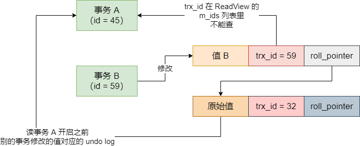

看到这里，大家有没有发现，多个事务并发执行的时候，通过这条 **ReadView + undo log** 日志链条的机制，就可以保证事务 A 不会读到并发执行的事务 B 更新的值，只会读到更早的值。

接着事务 A 自己更新了这行数据，改成了值 A，trx_id 修改为 45，同时保存之前事务 B 修改的值的快照，如下图：

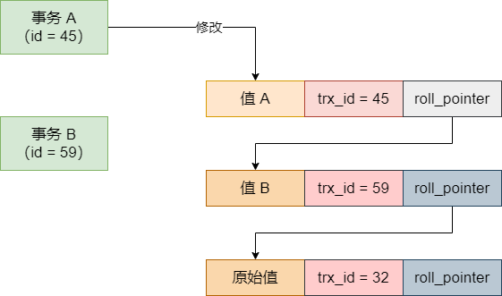

此时事务 A 来查询这条数据，会发现这个 trx_id = 45，跟自己的 ReadView 里的 creator_trx_id（45）是一样的，说明这行数据就是自己修改的，自己修改的值当然是可以看到的。

接着在事务 A 执行的过程中，突然开启了一个事务 C，这是事务的 id 是 78，然后它更新了那行数据的值为值 C，还提交了事务，如下图：

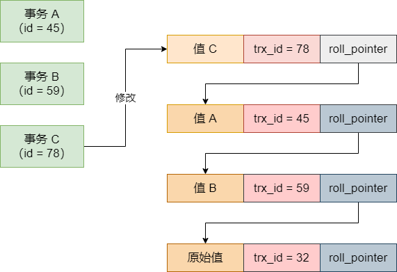

这个时候事务 A 再去查询，会发现当前数据的 trx_id = 78，大于自己的 ReadView 中的 max_trx_id（60），说明这个事务 A 开启之后，然后有一个事务更新了数据，自己当然是不能看到的。如图：

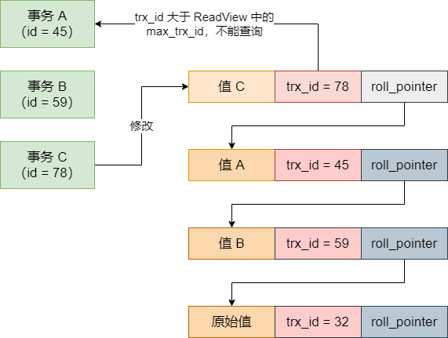

此时就会顺着 undo log 多版本链条往下找，自然先找到值 A 自己之前修改过的那个版本，因为那个 trx_id = 45 跟自己的 ReadView 里的 creator_trx_id 是一样的，所以此时直接读取自己之前修改的那个版本，如图：

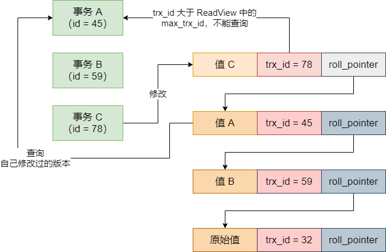

通过这一系列的图，相信每个人都能彻底理解 ReadView 的一套运行机制了。通过 undo log 多版本链条，加上你开启事务时候生产的一个 ReadView，然后再有一个查询的时候，根据 ReadView 进行判断的机制，你就知道你应该读取哪个版本的数据

而且它可以保证你只能读到你事务开启前，别的提交事务更新的值，还有就是你自己事务更新的值。假如说是你事务开启之前，还有别的事务正在运行，然后你事务开启之后，别的事务更新了值，你是绝对读不到的。或者是你事务开启之后，比你晚开启的事务更新了值，你也是读不到的。

