## 思维导图

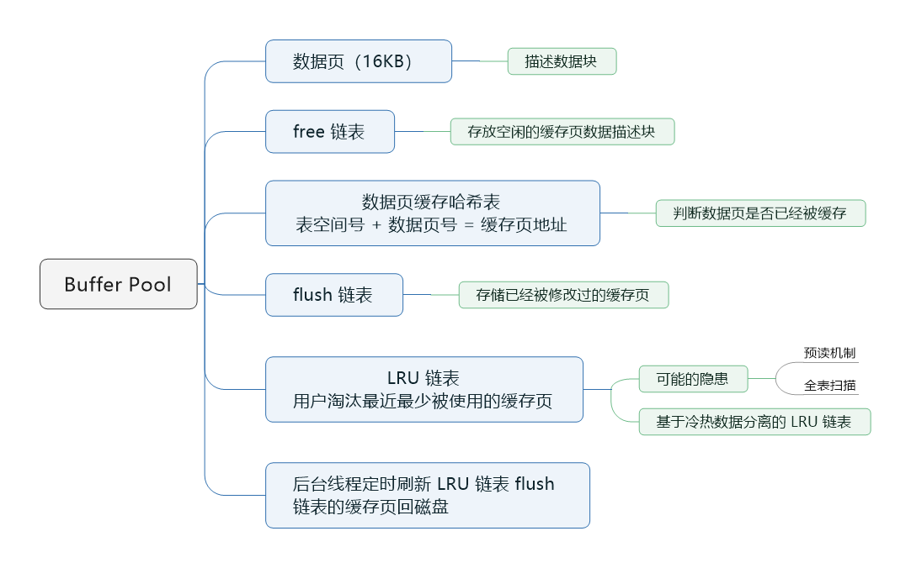

## 配置 Buffer Pool 的大小

Buffer Pool 本质上是数据库的一个内存组件，你可以理解它就是一片内存数据结构，所以这个内存数据结构肯定是有一定大小的，不可能是无限大的。这个 Buffer Pool 默认情况下是 128MB，还是有一点偏小的，我们实际生产环境可以对 Buffer Pool 进行调整。


比我我们数据库如果是 16 核 32G 的机器，那么你可以给 Buffer Pool 分配 2GB 的内存，使用下面的配置就可以了。

```mysql
[server]
innodb_buffer_pool_size = 2147483648
```


## Buffer Pool 的数据结构

### 数据页：MySQL 中抽象出来的数据单位

假设我们的数据库中有一片内存区域是 Buffer Pool 了，那么我们的数据如何放在 Buffer Pool 中？我们都知道数据库的核心数据模型就是表 + 字段 + 行的概念，即我们都知道数据库里有一个个表，一个表有很多字段，然后每个表里有许多行数据，每行数据都有自己的字段值。所以我们的数据是一行一行放在 Buffer Pool 里面的吗？


当然不是，实际上 MySQL 对数据抽象出来了一个数据页的概念，它是把很多行数据放在一个数据页里，也就是说我们的磁盘文件中会有很多的数据页，每一页数据放了很多行数据。所以实际上假设我们要更新一行数据，此时数据库会找到这行数据所在的数据页，然后从磁盘文件里把这行数据所在的数据页直接加载到 Buffer Pool 里去。也就是说，**Buffer Pool 中存放的是一个一个的数据页**。如图：

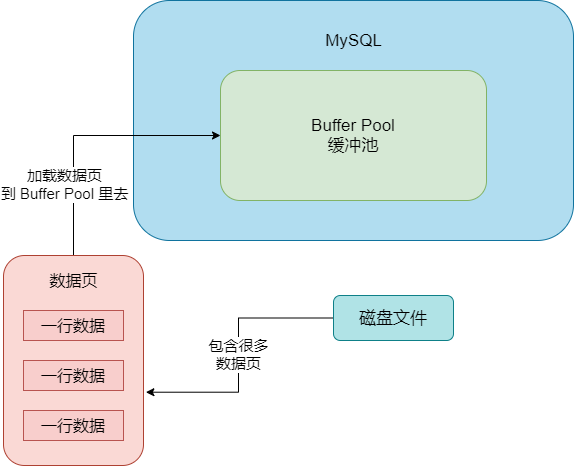


#### 磁盘上的数据文件和 Buffer Pool 中的缓存页如何对应起来

实际上默认情况下，磁盘中存放的数据页的大小是 **16KB**，即，一页数据包含了 16KB 的内容。而 Buffer Pool 中存放的一个一个的数据页，我们通常叫做缓存页，因为 Buffer Pool 是一个缓冲池，里面的数据都是从磁盘缓存到内存去的。


而 Buffer  Pool 中默认情况下，一个缓存页的大小和磁盘上的一个数据页的大小是一一对应起来的，都是 16KB。


#### 缓存页对应的描述信息

我们要知道一个概念，对于每个缓存页，它实际上都会有一个描述信息，这个描述信息大体可以认为是用来描述这个缓存页的。比如包含如下的一些东西：这个数据页所属的表空间、数据页的编号、这个缓存页在 Buffer Pool 中的地址以及别的一些东西。


每个缓存页都会对应一个描述信息，这个描述信息本身也是一块数据，在 Buffer Pool 中，每个缓存页的描述数据放在最前面，然后各个缓存页放在后面。所以，Buffer Pool 实际看起来大概长这个样子：

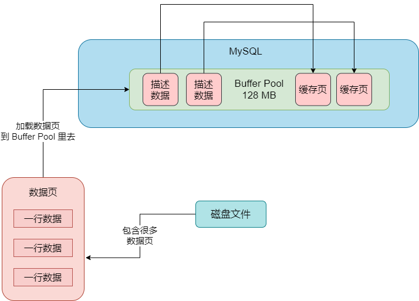


这里我们要注意一点，Buffer Pool 中的描述信息大概相当于缓存页大小的 5% 左右，也就是每个描述数据大概是 800 个字节左右的大小，然后假设你设置的 buffer pool 大小是 128MB，实际上 Buffer Pool 真正的最终大小会超出一些，可能有 130 多 MB 的样子，因为它里面还要存放每个缓存页的描述数据。


### Buffer Pool 中的 free 链表

通过上面的讲解我们大概知道 MySQL 中的 Buffer Pool 到底长什么样，那么在数据库启动的时候，它是如何初始化 Buffer Pool 的呢？


其实很简单，数据库只要一启动，就会按照你设置的 Buffer Pool 大小，稍微再加大一点，去找操作系统申请一块内存区域，作为 Buffer Pool 的内存区域。然后当内存区域申请完毕之后，数据库就会按照默认的缓存页的 16KB 的大小以及对应的 800 个字节左右的描述数据的大小，在 Buffer Pool 中划分出来一个一个的缓存页和一个一个它们对应的描述数据。


当数据库把 Buffer Pool 划分完毕之后，看起来就是上面的那张图。只不过这个时候，Buffer Pool 中的一个一个的缓存页都是空的，里面什么都没有，要等数据运行起来之后，当我们要对数据进行增删改查的操作的时候，才会把数据对应的页从磁盘文件里读取出来，放入 Buffer Pool 中的缓存页中。


#### 哪些缓存页是空闲的

当数据库运行起来之后，随着增删改查操作的执行，此时就需要不停地从磁盘上读取一个一个的数据页放入 Buffer Pool 中对应的缓存页里去，把数据缓存起来，那么以后就可以对这个数据在内存里执行相应操作了。


但是此时在磁盘上读取数据页放入 Buffer Pool 中的缓存页的时候，会涉及到一个问题：哪些缓存页是空闲的。因为默认情况下磁盘上的数据页和缓存页是一一对应起来的吗，都是 16KB，所以我们要知道 Buffer Pool 中哪些缓存页是空闲的状态。


所以数据库会为 Buffer Pool 设计一个 **free 链表**，它是一个双向链表数据结构。这个 free 链表里，**每个节点就是一个空闲的缓存页的描述数据块的地址**。也就是说，只要你一个缓存页是空闲的，那么它的描述数据块就会被放入这个 free 链表中。


刚开始数据库启动的时候，可能所有的缓存都是空闲的，因此此时可能是一个空的数据库，一条数据都没有，所以此时所有缓存页的描述数据块，都会被放入这个 free 链表中。

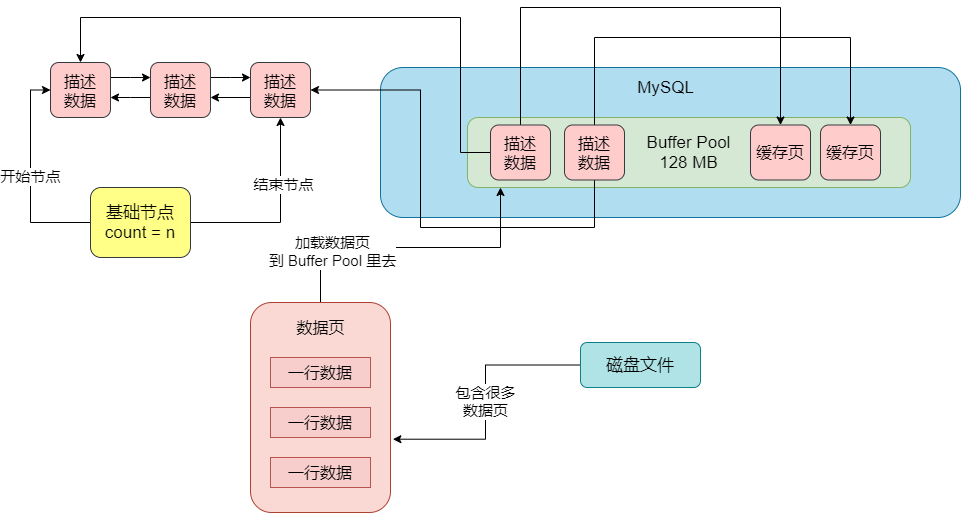


这个 free 链表里面就是各个缓存页的描述数据块，只要缓存页是空闲的，那么它们对应的描述数据块就会加入到这个 free 链表，每个节点都会双向链接自己的前后节点，组成一个双向链表。另外，这个 free 链表有一个基础节点，它会引用链表的头结点和尾节点，里面还存储了链表中有多少个描述数据块的节点，也就是有多少个空闲的缓存页。


#### free 链表占用多少内存空间

可能有人会以为这个描述数据块，在 Buffer Pool 里有一份，在 free 链表里也有一份，好像在内存里有两个一模一样的描述数据块。其实这个是错误的，这个 free 表，它本身就是由 Buffer Pool 里的描述数据块组成的，你可以认为是每个描述数据块里都有两个指针，一个是 free_pre，一个是 free_next，分别指向自己的上一个 free 链表的节点，以及下一个 free 链表的节点。


通过 Buffer Pool 中的描述数据块的 free_pre 和 free_next 两个指针，就可以把所有的描述数据块串成一个 free 链表。上面为了画图需要，所以把描述数据块单独画了一份出来，表示他们之间的指针引用关系。


对于 free 链表而已，只有一个基础节点是不属于 Buffer Pool 的，它是 40 字节大小的一个节点，里面存放了 free 链表的头结点的地址，尾结点的地址，还有 free 链表里当前有多少个节点。


#### 如何将磁盘上的页读取到 Buffer Pool 的缓存页中去

当你想要把磁盘上的数据页读取到 Buffer Pool 中的缓存页里去的时候，要怎么做？其实有了 free 链表之后，这就很简单了。


首先，我们需要从 free 链表里获取一个描述数据块，然后就可以对应的获取这个描述数据块对应的空间缓存页。接着我们就可以把磁盘上的数据页读取到对应的缓存页里去，同时把相关的一些描述数据写入到缓存页的描述数据块里去，比如这个数据页所属的表空间之类的信息，最后把那个描述数据块从 free 链表里去除就可以了。


#### 如何知道数据页有没有被缓存

我们在执行增删改查的时候，肯定是先看看这个数据页有没有被缓存，如果没被缓存就走上面的逻辑，从 free 链表中找到一个空闲的缓存页，从磁盘上读取数据页写入缓存页，写入描述数据，从链表中移除这个描述数据块。但是如果数据页已经被缓存了，那么就会直接使用了。


所以其实数据库还会有一个哈希表数据结构，它会用表空间号 + 数据页号，作为一个 key，然后缓存页的地址作为 value。当你要使用一个数据页的时候，通过 "表空间号 + 数据页号" 作为 key 去哈希表里查一下，如果没有就读取数据页，如果已经有了，就说明数据页已经被缓存了。

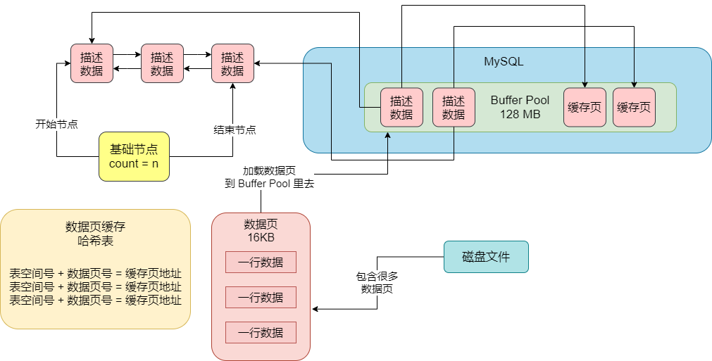


### Buffer Pool 中的 flush 链表

#### 脏缓存页

你在执行增删改的时候，如果发现数据页没缓存，那么会基于 free 链表找到一个空闲的缓存页，然后读取到缓存页里去，但是如果已经缓存了，那么下一次就必然会直接使用缓存页。即，你要更新的数据页都会在 Buffer Pool 的缓存页里，供你在内存页中直接执行增删改的操作。


接着你去更新 Buffer Pool 的缓存页中的数据，此时一旦你更新了缓存页中的数据，那么缓存页里的数据和磁盘上的数据页里的数据，就不一致了。这个时候，我们就说缓存页是脏数据，脏页。


#### 哪些缓存页是脏页

上面说的那些在内存里更新的脏页的数据，都是要被刷新会磁盘文件的。但就有一个问题，不可能所有的缓存页都刷回磁盘的，因为有的缓存页可能是因为查询的时候被读取到 Buffer Pool 里的，可能根本没有修改过！


所以数据库在这里引入了另外一个跟 free 链表类似的 **flush 链表**，这个 flush 链表本质也是通过缓存页的描述数据块中的两个指针，让被修改过的缓存页的描述数据块，组成一个双向链表。凡是被修改过的缓存页，都会把它的描述数据块加入到 flush 链表中去，flush 的意思就是这些都是脏页，后续都是要 flush 刷新到磁盘上的。


所以 flush 链表的结果跟 free 链表几乎是一样的，如图：

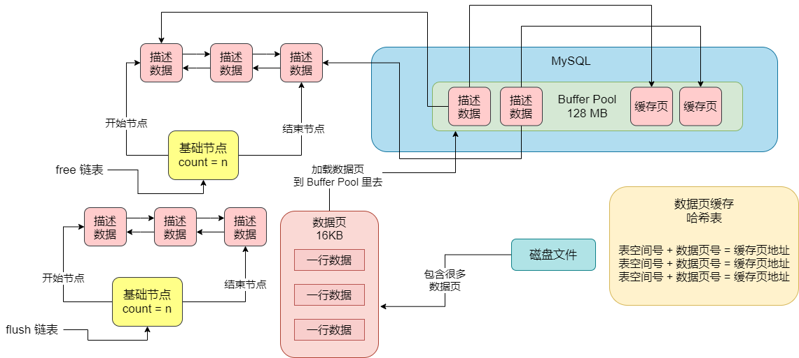


### Buffer Pool 中的缓存页不够时，基于 LRU 算法淘汰部分缓存

当我们执行 CRUD 操作的时候，无论是查询数据，还是修改数据，都会把磁盘上的数据页加载到缓存页里来。那么在加载数据到缓存页的时候，必然是要加载到空闲的缓存页里去的，所以必须要从 free 链表中找一个空闲的缓存页，然后把磁盘上的数据页加载到空闲的缓存页里去。


随着不停地把磁盘上的数据页加载到空闲的缓存页里去，free 链表中的空闲缓存页也会越来越少，当你不停地把磁盘上的数据页加载到空闲缓存页里去，free 链表中不停地移除空闲缓存页，迟早有那么一个瞬间，free 链表已经没有空闲缓存页了。


#### 淘汰掉一些缓存数据

如果所有的缓存页都被塞了数据，此时无法从磁盘上加载新的数据页到缓存页里去了，此时只有一个办法，**就是淘汰掉一些缓存页**。所谓的淘汰缓存页，就是把一个缓存页里修改过的数据，给刷到磁盘上的数据页里去，然后这个数据页就可以清空了，让它重新变成一个空闲的缓存页。接着你再把磁盘上需要的新的数据页加载到这个腾出来的空闲缓存页中去。


那要把一个缓存页里的数据刷入磁盘，腾出来一个空闲缓存页，那应该把哪个缓存页的数据给刷入磁盘呢？


#### 缓存命中率

这里我们先提一个概念，叫**缓存命中率**。假设现在有两个缓存页，一个缓存页的数据，经常会被修改和查询，比如在 100 次请求中，有 30 次都是在查询和修改这个缓存页里的数据，那么此时我们可以说这种情况下，缓存命中率很高。


另外一个缓存页里的数据，就是刚从磁盘加载到缓存页之后，就修改和查询过一次，之后100 次中没有一次是修改和查询这个缓存页的数据的，那么我们就说缓存命中率有点低。因为大部分请求可能还需奥走磁盘查询数据，它们要操作的数据不在缓存中。


一般来说我们都是优先淘汰缓存命中率低的缓存页。


#### 引入 LRU 链表来判断哪些缓存页是不常用的

接下来我们就要知道，哪些缓存页是经常被访问，哪些缓存页是很少被访问的。此时就要引入一个新的 LRU 链表了。这个所谓的 LRU 就是 Least Recently Used，最近最少使用的意思。


这个 LRU 链表的工作原理是什么？简单说就是，我们从磁盘加载一个数据页到缓存页的时候，就把缓存页的描述数据块放到 LRU 表头部去，那么只要有数据的缓存页，它都会在 LRU 里了，而且最近被加载数据的缓存页，都会放到 LRU 链表的头部去。


然后假设某个缓存页的描述数据块本来在 LRU 链表的尾部，后续只要你查询或者修改这个缓存页的数据，也要把这个缓存页挪动到 LRU 链表的头部去，也就是说最近被访问过的缓存页，一定在 LRU 链表的头部。 

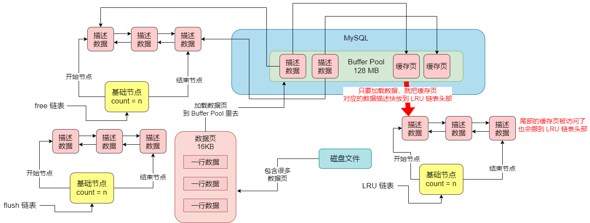


那样的话，当你的缓存页没有一个空闲的时候，你是不是要找出来那个最近最少被访问的缓存页去刷入磁盘？此时你就直接在 LRU 链表的尾部找到一个缓存页，它一定是最近最少被访问的那个缓存页。


然后你就把 LRU 链表尾部的那个缓存页刷入到磁盘中，然后把你需要的磁盘数据页加载到腾出来的空闲缓存页就可以了。


### 简单的 LRU 链表在 Buffer Pool 实际运行中可能导致的问题

上面说的那个 LRU  机制在实际运行过程中，是存在巨大的隐患的。首先会带来隐患的就是 MySQL 的预读机制。这个所谓的预读机制，就是当你从磁盘上加载一个数据页的时候，它可能会连带着把这个数据页相邻的其他数据页，也加载到缓存里去。


例如，现在有两个空闲的缓存页，然后在加载一个数据页的时候，连带着把它的一个相邻的数据页也加载到缓存里去了。但是，实际上只有一个缓存页是被访问了，另外一个通过预读机制加载的缓存页，其实没人访问，此时这两个缓存页都在 LRU 链表的前面。如图：

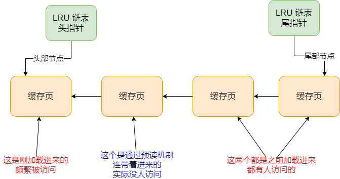


例如上面的情景，前两个缓存页都是刚加载进来的，但是此时第二个缓存页是通过预读机制连到这加载进来的，它也被放到了链表的前面，但实际上没人访问它。


除此之外还有尾巴上的两个缓存页，都是一直有人访问的缓存页，只不过上图代表的是刚刚把头部两个缓存页加载进来的时候的一个 LRU 链表当时的情况。这个时候，如果空闲页没有了，此时要加载新的数据页了，是不是就要从 LRU 链表的尾部把所谓的 "最近最少使用的一个缓存页" 给刷入磁盘，腾出一个空闲缓存页出来？


这个是不合理的。最后一个之前一直频繁被人访问，只不过在这一个瞬间，被新加载进来的两个缓存页给占据了 LRU 链表前面的位置，尤其是第二个缓存页，还是通过预读机制加载进来的。根本没人访问。所以最合理的应该是把上图中第二个通过预读机制加载进来的缓存页给输入磁盘和清空。


#### 哪些情况会触发 MySQL 的预读机制

以下情况会触发 MySQL 的预读机制：

- 有一个参数是 `innodb_read_ahead_threshold`，它的默认值是 56，意思是如果顺序访问了一个区里的多个数据页，访问的数据页的数量超过了这个阈值，此时就会触发预读机制，把下一个相邻区的所有数据页都加载到缓存里去。

- 如果 Buffer Pool 里缓存了一个区里的 13 个连续的数据页，而且这些数据页都是比较频繁会被访问的，此时就会直接触发预读机制，把这个区里的其他的数据页都加载到缓存里去。这个机制是 `innodb_random_read_ahead` 来控制的，它默认是 OFF，也就是关闭的。


所以默认情况下，主要是第一个规则可能触发预读机制，一下子就把很多相邻区里的数据页加载到缓存里去，这些缓存页如果一下子都放在 LRU 链表的前面，而且没什么人会访问的话，就会跟上图一样，导致本来就在缓存里的一些频繁被访问的缓存页在 LRU 链表的尾部。


#### 另外一种可能导致频繁被访问的缓存页被淘汰的场景

另外一种可能，就是**全表扫描**。


例如 `SELECT * FROM users`。它没加任何一个 where 条件，会导致它直接一下子把这个表里所有的数据页，都从磁盘加载到 Buffer Pool 里去。这个时候它可能会一下子就把这个表的所有数据页都一一装入各个缓存页里去，此时可能 LRU 链表中排在前面的一大串缓存页，都是全表扫描加载进来的缓存页。如果这次全表扫描过后，后续几乎没用到这个表的数据呢？


此时 LRU 链表的尾部，可能全部都是之前一直被频繁访问的那些缓存页。然后当你要淘汰一些缓存页腾出空间的时候，就会把 LRU 链表尾部一直被频繁访问的缓存页给淘汰掉，而留下了之前全表扫描加载进来的大量不经常访问的缓存页。


### 基于冷热数据分离的思想设计 LRU 链表

为了解决上面说的简单 LRU 链表的问题，真正 MySQL 在设计 LRU 链表的时候，采取的是冷热数据分离的思想。真正的  LRU 链表，会被拆分为两个部分，一部分是热数据，一部分是冷数据。这个冷热数据的比例是由 `innodb_old_blocks_pct` 参数控制的，默认是 37，也就说冷数据占比 37%。如图：

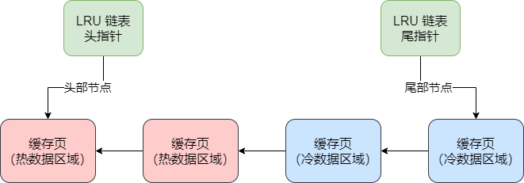


#### 数据页第一次被加载到缓存的时候

既然 LRU 链表已经按照比例拆分成了冷热两块区域，那么在运行期间，冷热两个区域是如何使用的。


首先数据页第一次被加载到缓存的时候，缓存页会被放在冷数据区域的链表头部。

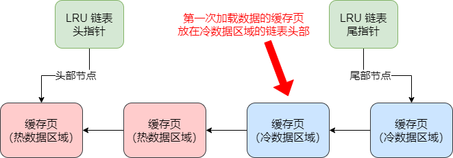


#### 冷数据区域的缓存页何时被放入热数据区域

接着下一个问题。冷数据区域的缓存页什么时候会放到热数据区域呢？MySQL 设计了一个柜子，它设计了 `innodb_old_blocks_time` 参数，默认值是 1000，也就是 1000 毫秒。即，必须是一个数据页被加载到缓存页之后，在 1s 之后，你访问这个缓存页，它才被挪动到热数据区域的链表头部去。


因为假设你加载了一个数据页到缓存区，然后过了 1s 之后你还访问了这个缓存页，说明你后续很可能会经常访问它。这个时间限制就是 1s，只有了 1s 后访问了这个缓存页，它才会把缓存页放到热数据区域的链表头部去。


### 如何用冷热数据分离 LRU 链表解决简单 LRU链表带来的隐患

#### 预读以及全表扫描加载进来的一大堆缓存页

在基于冷热数据分离的 LRU 链表的方案下，预读机制以及全表扫描加载进来的一大堆缓存页，他们会放在哪里？明显是放在 LRU 链表的冷数据区域的前面。


假设这个时候热数据区域已经有很多被频发访问的缓存页了，你会发现热数据区域还是存放被频发访问的缓存页，只要热数据区域有缓存页被访问，它还是会被移动到热数据区域的链表头部去。


所以，预读机制和全表扫描加载进来的一大堆缓存页，此时都在冷数据区域里，跟热数据区域里的频繁访问的缓存页，是没有关系的。

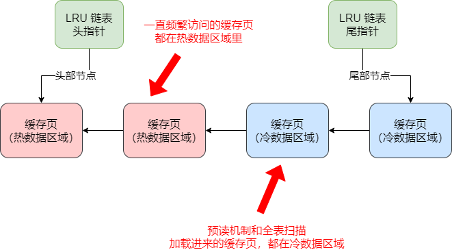


#### 预读机制和全表扫描加载进来的缓存页，何时进热数据区域

如果你仅仅是一个全表扫描的查询，此时肯定是在 1s 内就把一大堆缓存页加载进来，然后就访问了这些缓存页一下，通常这些操作 1s 内就结束了。


所以基于目前的一个机制，可以确定的是，这种情况下，那么缓存页是不会从冷数据区域转移到热数据区域的。除非你在冷数据区域里的缓存页，在 1s 之后还被人访问了，那么此时它们就会判定未来可能会被频繁访问的缓存页，然后移动到热数据区域的链表头部去。


#### 如何淘汰一些缓存

假设此时缓存页不够了，需要淘汰一些缓存页，要怎么处理？


方法时直接可以找到 LRU 链表中的冷数据区域的尾部的缓存页，他们肯定是之前就被加载进来的，而且加载进来 1s 过后都没人访问过，说明这个缓存页是冷数据。所以此时就直接淘汰冷数据区域的尾部缓存页，刷入磁盘，就可以了。


### LRU 链表热数据区域的优化

接着我们看一下 LRU 链表的热数据区域的一个性能优化的点，就是，在热数据区域中，如果你访问了一个缓存页，是否应该要把它立刻移动到热数据区域的链表头部去？


这个是没必要的。因为热数据区域里的缓存页可能是经常被访问的，所以这么频繁地进行移动性能也不是太好，也没必要。


因此，LRU 链表的热数据区域的访问规则被优化了一下，即你只有在热数据区域的后 3/4 部分的缓存页被访问了，才会给你移动到链表头部去。如果你是热数据区域的前面 1/4 的缓存页被访问了，它是不会被移动到链表头部的。


例如，假设热数据区域的链表里有 100 个缓存页，那么排在前面的 25 个缓存页，即使被访问了，也不会移动到链表头部去。但是对于后面的 75 个缓存页，只要被访问，就会移动到链表头部去。


### 对于 LRU 链表中尾部的缓存页，如何淘汰他们刷入磁盘

Buffer Pool 在运行过程中被使用的时候，实际上会频繁地从磁盘上加载数据页到它的缓存页里去，然后 free 链表、flush 链表、lru 链表都会在使用的使用同时被使用。


比如数据加载到一个缓存页，free 链表里会移除这个缓存页，然后 lru 链表的冷数据区域的头部会放入这个缓存页。


然后如果你修改了一个缓存页，那么 flush 链表中会记录这个脏页，lru 链表还可能会把你从冷数据区域移动到热数据区域的头部去。


总之，MySQL 在执行 CRUD 的时候，首先是大量的操作缓存页以及对应的几个链表。然后再缓存页都满的时候，必然要想办法把一些缓存页给刷入磁盘，然后清空这几个缓存页，接着把需要的数据页加载到缓存里去。我们已经知道它是根据 LRU 链表去淘汰缓存页的，那么它到底什么时候把 LRU 链表的冷数据区域中的缓存页刷入到磁盘呢？


#### 定时把 LRU 尾部的部分缓存刷入磁盘

首先第一个时机，并不是在缓存页满的时候，才会挑选 LRU 冷数据区域尾部的几个缓存页刷入磁盘，而是有一个后台线程，它会运行一个定时任务，这个定时任务每隔一段时间就会把 LRU 链表的冷数据区域的尾部一些缓存页，刷入磁盘里去，清空这几个缓存页，把他们加入回 free 链表去。


所以实际上在缓存页没用完的时候，可能就会清空一些缓存页了。

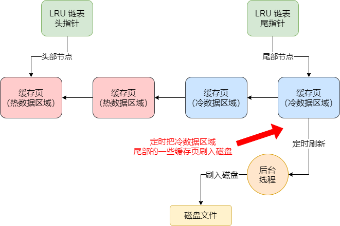


所以，只要有这个后台线程定时运行，可能你的缓存还没用完，人家就把一批冷数据的缓存页刷入磁盘，清空出一批缓存页了，那么你就多了一批可以使用的缓存页了。只要有缓存页被刷入磁盘，那么这个缓存页必然会加入到 free 链表，从 flush 链表中移除，从 lru 链表中移除。


#### 把 flush 链表中的一些缓存页定时刷入磁盘

如果仅仅把 LRU 链表中的冷数据区域的缓存页刷入磁盘，明显是不够的，因为在 LRU 链表的热数据区域里很多缓存页可能也会被频繁地修改，难道它们永远都不刷入磁盘中了吗？


所以这个后台线程同时也会在 MySQL 不那么繁忙的时候，找个时间把 flush 链表中的缓存页都刷入磁盘中，这样被你修改过的数据，迟早都会刷入磁盘的。


只要 flush 链表中的一波缓存页被刷入磁盘，那么这些缓存页也会从 flush 链表和 LRU 链表中移除，然后加入到 free 链表中去。


可以理解为，你一边不停地加载数据到缓存页里去，不停地查询和修改缓存数据，然后 free 链表页不停地减少，flush 链表中的缓存页不停地在增加，lru 链表中的缓存页不停地在增加和移动；另外一边，你的后台线程不停地把 LRU 链表的冷数据区域的缓存页以及 flush 链表的缓存页，刷入磁盘中来清空缓存页，然后 flush 链表和 LRU 链表中的缓存页不断减少，free 链表中的缓存页不断增加。


这就是一个动态运行起来的效果！


### 实在没有空闲缓存页怎么办

如果实在没有空闲缓存页了怎么办？此时可能所有的 free 链表都被使用了，然后 flush 链表中有一大堆被修改过的缓存页，LRU 链表中有一大堆的缓存页，根据冷热数据进行了分离，大致是如此的效果。


这个时候如果要从磁盘加载数据页到一个空闲缓存页中，此时就会从 LRU 链表的冷数据区域的尾部找到一个缓存页，它一定是最不经常使用的缓存页。然后把它刷入磁盘和清空，然后把数据页加载到这个腾出来的空闲缓存页里去。


这就是 MySQL 的 Buffer Pool 缓存机制的一整套运行原理。


