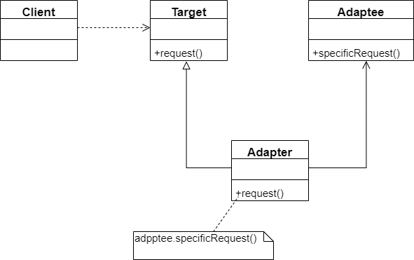
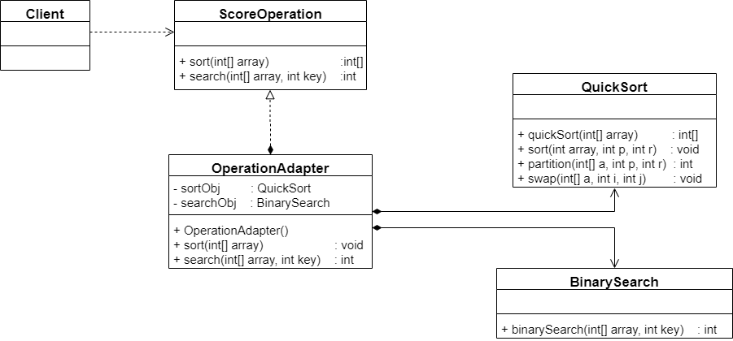
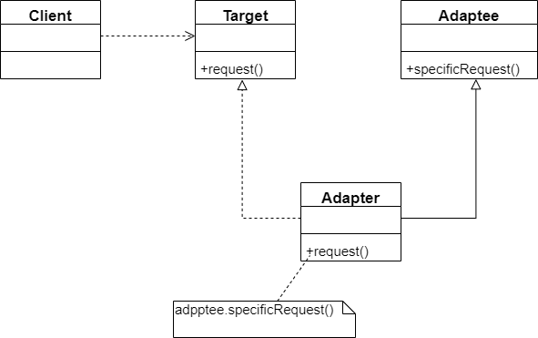
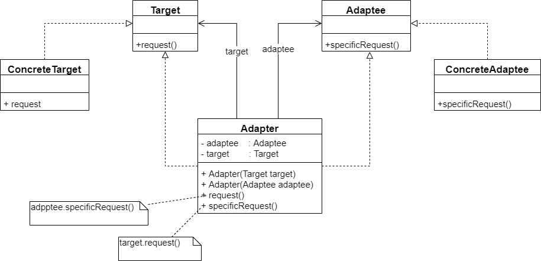
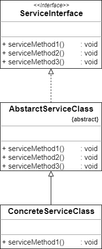

有的笔记本电脑的工作电压是 20V，而我国的家庭用电是 220V，如何让 20V 的笔记本电脑能够在 220V 的电压下工作？答案是引入一个电源适配器（AC Adapter），俗称充电器或者变压器。有了这个电源适配器，生活用电和笔记本电脑即可兼容。


在软件开发中，有时也存在这种不兼容的情况，也可以像引入一个电源适配器一样引入一个称之为适配器的角色来协调这些不兼容的结构，这种设计方案即为适配器模式。


## 示例

> Sunny 公司在很久以前曾开发了一个算法库，里面包含了一些常用的算法。例如排序算法和查找算法，在进行各类软件开发是经常需要重用该算法。在为某学校开发教务管理系统时，开发人员发现需要对学生进行排序和查找。该系统的设计人员已经开发了一个成绩操作接口 `ScoreOperation`，在该接口中声明了排序方法 `sort(int[])` 和查找方法 `search(int[], int)`。为了提高排序和查找的效率，开发人员决定重用算法库中的快速排序算法类 `QuickSort` 和二分查找类 `BinarySearch`。其中 QuickSort 的 `quickSort(int[])` 方法实现了快速排序，BinarySearch 的 `binarySearch(int[], int)` 方法实现了二分查找
>
> 
>
> 由于某些原因，现在 Sunny 公司开发人员已经找不到该算法库的源代码，无法直接通过复制和粘贴操作来重用其中的代码，部分开发人员已经针对 `ScoreOperation` 接口编程，如果再要求对该接口进行修改或要求大家直接使用 `QuickSort` 类和 `BinarySearch` 类将导致大量代码需要修改
>
> 
>
> Sunny 公司面对这个没有源码的算法库，遇到一个幸福而又烦恼的问题：如何在既不修改现有接口有不需要任何算法库代码的基础上实现算法库的重用？


通过分析，现在 Sunny 公司面对的问题有点类似最开始提到的电压问题，成绩操作接口 `ScoreOperation` 好比只支持 20V 电压的笔记本电脑，而算法库好比 220V 的家庭用电，这两部分都没有办法再进行修改，而且他们原本是两个完全不相关的结构。而这种情况就非常适合适配者模式去解决。


## 适配器模式概述

与电源适配器相似，在适配器模式中引入了一个被称为适配器（Adapter）的包装类，而它所包装的对象称之为适配者（Adaptee），即被适配的类。适配器的实现就是把客户类的请求转化为对适配者的相应接口的调用，即，当客户类调用适配器的方法时，在适配器类的内部将调用适配者类的方法，而这个过程对客户类是透明的，客户类并不直接访问适配者类。因此，适配器让那些由于接口不兼容而不能相互交互的类可以一起工作。


适配器模式可以将一个类的接口和另一个类的接口匹配起来，而无须修改原来的适配者接口或者抽象目标类接口。适配器模式定义如下：


> **适配器模式**：将一个接口转换成客户希望的另一个接口，使接口不兼容的那些类可以一起工作，其别名为包装器（Wrapper）。适配器模式既可以作为类结构模式，也可以作为对象结构型模式。


在适配器模式中，通过增加一个新的适配器类来解决接口不兼容的问题，使得原本没有任何关系的类可以协同工作。根据适配器类与适配者类的关系不同，适配器模式可以分为**对象适配器模式**和**类适配器模式**两种。在对象适配器模式中，适配器与适配者之间是关联关系；在类适配器模式中，适配器与适配者之间是继承（或实现）关系。在实际开发中，对象适配器模式的使用频率更高，如图：




上图可以看出，在对象适配器模式结构图中包含以下 3 个角色：

- **Target（目标抽象类）**：目标抽象类定义客户所需接口，可以是一个抽象类或者接口，也可以是具体类。

- **Adapter（适配器类）**：适配器可以调用另一个接口，作为一个转换器，对 Adaptee 和 Target 进行适配。适配器类是适配器模式的核心，在对象适配器模式中，它通过继承 Target 并关联一个 Adaptee 对象使二者产生联系

- **Adaptee（适配者类）**：适配者即被适配的角色，它定义了一个已经存在的接口，这个接口需要适配，适配者类一般是一个具体类，包含了客户希望使用的业务方法，在某些情况下可能没有适配者类的源代码


在上图中，客户端需要使用 `request()` 方法，而适配者类 Adaptee 没有该方法，但是它所提供的 `specificRequest()` 方法却是客户端所需要的。为了使客户端能够使用适配者类，需要提供一个包装类 Adapter，即适配器，这个包装类包装了一个适配者的实例，从而将客户端与适配者衔接起来，在适配器的 request() 方法中调用适配者的 specificRequest() 方法。因为适配器类与适配者类是关联关系（也可称之为委派关系），所以这种适配器模式称为对象适配器模式。伪代码如下：

```java
class Adapter extends Target {
	// 维持一个对适配者对象的引用
	private Adaptee adaptee;
	
	public Adapter(Adaptee adaptee) {
		this.adaptee = adaptee;
	}
	
	public void request() {
		adaptee.specificRequest();
	}
}
```


## 示例解决方案

Sunny 公司开发人员决定使用适配器模式来重用算法库中的算法，其基本结构如下：




代码如下：

```java
/**
 * @Description: 抽象成绩操作类：目标接口
 * 
 */
public interface ScoreOperation {

    /**
     * 成绩排序
     * @param array
     * @return
     */
    int[] sort(int[] array);

    /**
     * 成绩查找
     * @param array
     * @param key
     * @return
     */
    int search(int[] array, int key);
}
```

```java
/**
 * @Description: 快速排序类：适配者
 * 
 */
public class QuickSort {

    public int[] quickSort(int[] array) {
        sort(array, 0, array.length - 1);
        return array;
    }

    public void sort(int[] array, int p, int r) {
        int q = 0;
        if(p < r) {
            q = partition(array, p, r);
            sort(array, p, q - 1);
            sort(array, q + 1, r);
        }
    }

    public int partition(int[] a, int p, int r) {
        int x = a[r];
        int j = p - 1;

        for(int i = p; i <= r - 1; i++) {
            if(a[i] <= x) {
                j++;
                swap(a, j, i);
            }
        }

        swap(a, j + 1, r);
        return j +1;
    }

    public void swap(int[] a, int i, int j) {
        int t = a[i];
        a[i] = a[j];
        a[j] = t;
    }
}
```

```java
/**
 * @Description: 二分查找类：适配者
 * 
 */
public class BinarySearch {

    public int binarySearch(int[] array, int key) {
        int low = 0;
        int high = array.length - 1;

        while(low <= high) {
            int mid = ((high - low) >> 1) + low;
            int midVal = array[mid];

            if(midVal < key) {
                low = mid + 1;
            }else if(midVal > 1) {
                high = mid - 1;
            }else{
                return 1;
            }
        }
        return -1;
    }
}
```

```java
/**
 * @Description: 操作适配器：适配器
 * 
 */
public class OperationAdapter implements ScoreOperation {

    /**
     * 定义适配者 QuickSort 对象
     */
    private QuickSort sortObj;

    /**
     * 定义适配者 BinarySearch 对象
     */
    private BinarySearch searchObj;

    public OperationAdapter() {
        sortObj = new QuickSort();
        searchObj = new BinarySearch();
    }
    @Override
    public int[] sort(int[] array) {
        return sortObj.quickSort(array);
    }

    @Override
    public int search(int[] array, int key) {
        return searchObj.binarySearch(array, key);
    }
}
```


## 类适配器模式

除了对象适配器模式之外，适配器还有一种模式，那就是类适配器模式。类适配器模式与对象适配器模式最大的区别在于其适配器和适配者之间的关系是继承关系。如图：




如上图所示，适配器类实现了抽象目标类接口 Target，并继承了适配者类，在适配器类的 request() 方法中调用所继承的适配者类的 specificRequest() 方法，实现了适配。典型的类适配器代码如下：

```java
class Adapter extends Adaptee implements Target {

	public void request() {
	
		specificRequest();
	}
}
```


由于 Java、C# 等语言不支持多重类继承，因此类适配器模式的使用受到很多限制，例如，如果目标抽象类 Target 不是借口，而是一个类，就无法使用类适配器模式；此外，如果适配者 Adaptee 为最终（final）类，也无法使用类适配器模式。在 Java 等面向对象编程语言中，大部分情况下使用的是对象适配器模式，类适配器模式较少使用


## 双向适配器模式

在对象适配器模式的使用过程中，如果在适配中同时包含对目标类和适配者类的引用，适配者可以通过它调用目标类中的方法，那么该适配器就是一个双向适配器，如下图：




双向适配器的实现较为复杂，典型代码如下：

```java
class Adapter implements Target, Adaptee {

	// 同时维持对抽象目标类和适配者的引用
	private Target target;
	private Adaptee adaptee;
	
	public Adapter(Target target) {
		this.target = target;
	}
	
	public Adapter(Adaptee adaptee) {
		this.adaptee = adaptee;
	}
	
	public void request() {
		adaptee.specificRequest();
	}
	
	public void specificRequest() {
		target.request();
	}
}
```


## 缺省适配器模式

缺省适配器模式是适配器模式的一种变体，其应用也较为广泛。缺省适配器模式的定义如下：


> **缺省适配器模式**：当不需要实现一个接口所提供的所有方式时，可以先设计一个抽象类实现该接口，并为接口中每个方法提供一个默认实现（空方法），那么该抽象类的子类可以选择性地覆盖父类的某些方法来实现需求，它适用于不想使用一个接口中的所有方法的情况，又称为单接口适配器模式


它的结构图如图所示：




在缺省适配器模式结构图中，包含 3 个角色：

- **ServiceInterface（适配者接口）**：它是一个接口，通常在该接口中声明了大量的方法

- **AbstractServiceClass（缺省适配器类）**：它是缺省适配器模式的核心类，使用空方法的形式实现了在 ServiceInterface 接口中声明的方法。通常将它定义为抽象类，因为对它进行实例化没有任何意义

- **ConcreteServiceClass（具体业务类）**：它是缺省适配器类的子类，在没有引入适配器之前，它需要实现适配者接口，因此需要实现在适配者接口中定义的所有方法，而对于一些无法使用的方法也不得不提供空实现。在有了缺省适配器模式之后，可以直接继承该适配器，根据需要有选择性地覆盖在适配器类中定义的方法


在JDK类库的事件处理包 java.awt.event 中广泛使用了缺省适配器模式，例如 WindowAdapter、KeyAdapter、MouseAdapter等。下面以处理窗口事件为例来进行说明。在 Java 语言中，一般可以使用两种方式来实现窗口事件处理类，一种是通过实现 WindowListener 接口，另一种是通过继承 WindowAdapter 适配器类。如果是使用第一种方式，直接实现 WindowListener 接口，事件处理类需要实现在该接口中定义的 7 个方法，而对于大部分需求可能只需要实现一两个方法，其他方法都无须实现。但由于语言特性，设计人员不得不为其他方法也提供-一个简单的实现（通常是空实现），这给使用带来了麻烦。而使用缺省适配器模式就可以很好地解决这一问题，在 JDK 中提供了一个适配器类 WindowAdapter 来实现 WindowListener 接口，该适配器类为接口中的每一个方法都提供了一个空实现，此时事件处理类可以继承 WindowAdapter 类，而无须再为接口中的每个方法都提供实现。


## 适配器模式总结

适配器模式将现有接口转化为客户类所期望的接口，实现了对现有类的复用。它是一种使用频率非常高的设计模式，在软件开发中得以广泛应用，在 Spring 等开源框架、驱动程序设计（例如 JDBC 中的数据库驱动程序）中也使用了适配器模式


### 主要优点

无论是对象适配器模式还是类适配器模式，都有以下优点：

1. 将目标类和适配者类解耦，通过引入一个适配器类来重用现有适配者类，无须修改原有结构
2. 增加了类的透明性和复用性，将具体的业务实现过程封装在适配者类中，对于客户端类而言是透明的，而且提高了适配者类的复用性，同一个适配者类可以在多个不同的系统中复用
3. 灵活性和扩展性都非常好，通过使用配置文件，可以很方便地更换适配器，也可以在不修改原有代码的基础上增加新的适配器，符合开闭原则


具体来说，类适配器模式还有这样的优点：由于适配器类是适配者类的子类，因此可以在适配器类中置换一些适配者的方法，是的适配器的灵活性更强。


对象适配器模式还有如下优点：

- 一个对象适配器可以把多个不同的适配者适配到同一个目标

- 可以适配一个适配者的子类，由于适配器和适配者之间是关联关系，根据里氏代换原则，适配者的子类也可以通过该适配器进行适配


### 主要缺点

类适配器模式的缺点如下：

1. 对于 Java、C# 等不支持多重类继承的语言，一次最多只能适配一个适配者类，不能同时适配多个适配者

2. 适配者不能为最终类，例如 Java 中不能为 final 类，C# 中不能为 sealed 类

3. 在 Java、C# 等语言中，类适配器模式中的目标对象类只能为接口，不能为类，其使用具有一定的局限性

   

对象适配器模式的缺点是：与类适配器相比，要在适配器中置换适配者类的某些方法有些麻烦。如果一定要置换掉适配者类的一个或多个方法，可以先做一个适配者类的子类，在子类中将适配者类的方法置换掉，然后再把适配者类的子类当做真正的适配者进行适配，实现过程较为复杂


## 参考资料

《设计模式的艺术——软件开发人员内功修炼之道》 – 刘伟