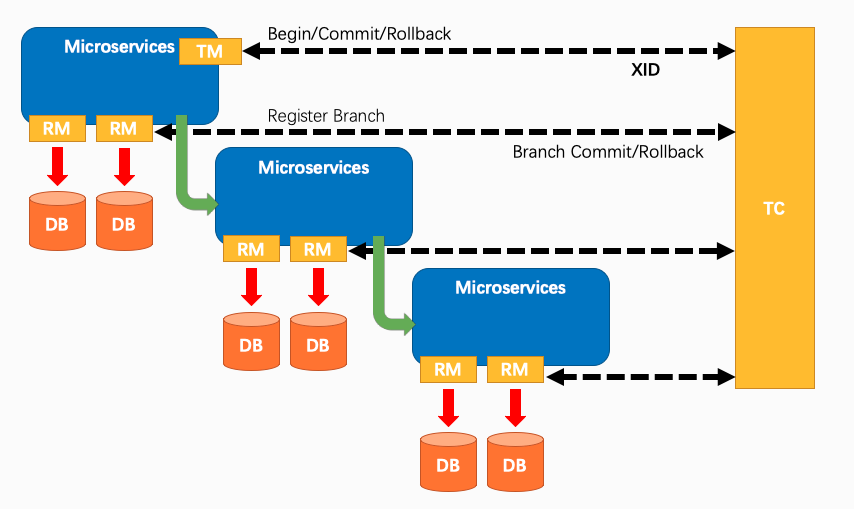
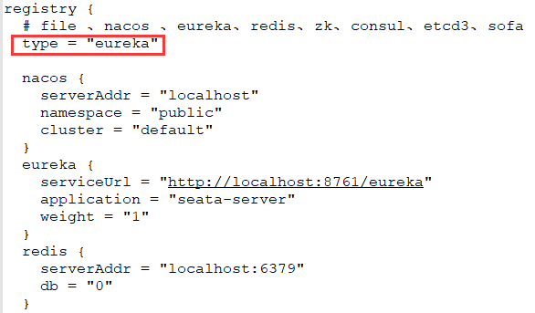
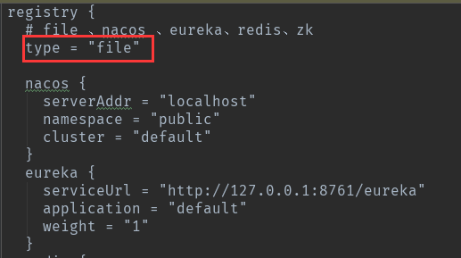
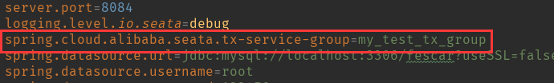
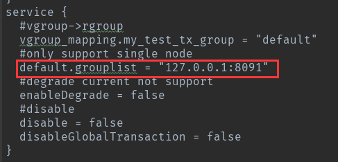
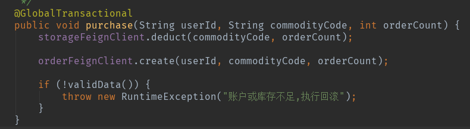

​		在分布式系统中，分布式事务是一个必须要解决的问题，目前使用较多的是最终一致性方案。自年初阿里开源了Fescar（四月初更名为Seata）后，该项目受到了极大的关注，目前已接近 8000 Star。[Seata](https://link.zhihu.com/?target=https%3A//github.com/seata/seata)以高性能和零侵入的特性为目标解决微服务领域的分布式事务难题，目前正处于快速迭代中。

## seata的几个概念

​		在讲解seata的原理之前，我们先了解几个Seata的相关概念。

- XID：全局事务的唯一标识，由 ip:port:sequence 组成；
- Transaction Coordinator (TC)：事务协调器，维护全局事务的运行状态，负责协调并驱动全局事务的提交或回滚；
- Transaction Manager (TM )：控制全局事务的边界，负责开启一个全局事务，并最终发起全局提交或全局回滚的决议；
- Resource Manager (RM)：控制分支事务，负责分支注册、状态汇报，并接收事务协调器的指令，驱动分支（本地）事务的提交和回滚；



## seata的简单使用

​		本文主要基于springcloud + Eureka + mysql + seata的结构搭建一个分布式系统的demo。具体步骤如下：

1. 下载Eureka的demo

   https://github.com/seata/seata-samples/tree/master/springcloud-eureka-seata

2. 下载seata-server 0.8.0

   https://github.com/seata/seata/releases

3. 创建数据库fescar，并用Navicat执行一个SQL文件创建相应测试用的表格和数据，内容如下：（这一步其实可以省略，demo中配置文件的数据库地址其实是有效的）

   ```mysql
   /*
    Navicat Premium Data Transfer
   
    Source Server         : seata
    Source Server Type    : MySQL
    Source Server Version : 50616
    Source Host           : 47.95.78.215:3306
    Source Schema         : fescar
   
    Target Server Type    : MySQL
    Target Server Version : 50616
    File Encoding         : 65001
   
    Date: 23/08/2019 11:22:20
   */
   
   SET NAMES utf8mb4;
   SET FOREIGN_KEY_CHECKS = 0;
   
   -- ----------------------------
   -- Table structure for account_tbl
   -- ----------------------------
   DROP TABLE IF EXISTS `account_tbl`;
   CREATE TABLE `account_tbl`  (
     `id` int(11) NOT NULL AUTO_INCREMENT,
     `user_id` varchar(255) CHARACTER SET utf8 COLLATE utf8_general_ci NULL DEFAULT NULL,
     `money` int(11) NULL DEFAULT 0,
     PRIMARY KEY (`id`) USING BTREE
   ) ENGINE = InnoDB AUTO_INCREMENT = 214 CHARACTER SET = utf8 COLLATE = utf8_general_ci ROW_FORMAT = Compact;
   
   -- ----------------------------
   -- Records of account_tbl
   -- ----------------------------
   INSERT INTO `account_tbl` VALUES (213, 'U100000', 10000);
   
   -- ----------------------------
   -- Table structure for order_tbl
   -- ----------------------------
   DROP TABLE IF EXISTS `order_tbl`;
   CREATE TABLE `order_tbl`  (
     `id` int(11) NOT NULL AUTO_INCREMENT,
     `user_id` varchar(255) CHARACTER SET utf8 COLLATE utf8_general_ci NULL DEFAULT NULL,
     `commodity_code` varchar(255) CHARACTER SET utf8 COLLATE utf8_general_ci NULL DEFAULT NULL,
     `count` int(11) NULL DEFAULT 0,
     `money` int(11) NULL DEFAULT 0,
     PRIMARY KEY (`id`) USING BTREE
   ) ENGINE = InnoDB AUTO_INCREMENT = 247 CHARACTER SET = utf8 COLLATE = utf8_general_ci ROW_FORMAT = Compact;
   
   -- ----------------------------
   -- Table structure for storage_tbl
   -- ----------------------------
   DROP TABLE IF EXISTS `storage_tbl`;
   CREATE TABLE `storage_tbl`  (
     `id` int(11) NOT NULL AUTO_INCREMENT,
     `commodity_code` varchar(255) CHARACTER SET utf8 COLLATE utf8_general_ci NULL DEFAULT NULL,
     `count` int(11) NULL DEFAULT 0,
     PRIMARY KEY (`id`) USING BTREE,
     UNIQUE INDEX `commodity_code`(`commodity_code`) USING BTREE
   ) ENGINE = InnoDB AUTO_INCREMENT = 1135 CHARACTER SET = utf8 COLLATE = utf8_general_ci ROW_FORMAT = Compact;
   
   -- ----------------------------
   -- Records of storage_tbl
   -- ----------------------------
   INSERT INTO `storage_tbl` VALUES (1134, 'C100000', 200);
   
   -- ----------------------------
   -- Table structure for undo_log
   -- ----------------------------
   DROP TABLE IF EXISTS `undo_log`;
   CREATE TABLE `undo_log`  (
     `id` bigint(20) NOT NULL AUTO_INCREMENT,
     `branch_id` bigint(20) NOT NULL,
     `xid` varchar(100) CHARACTER SET utf8 COLLATE utf8_general_ci NOT NULL,
     `context` varchar(128) CHARACTER SET utf8 COLLATE utf8_general_ci NOT NULL,
     `rollback_info` longblob NOT NULL,
     `log_status` int(11) NOT NULL,
     `log_created` datetime(0) NOT NULL,
     `log_modified` datetime(0) NOT NULL,
     `ext` varchar(100) CHARACTER SET utf8 COLLATE utf8_general_ci NULL DEFAULT NULL,
     PRIMARY KEY (`id`) USING BTREE,
     UNIQUE INDEX `ux_undo_log`(`xid`, `branch_id`) USING BTREE
   ) ENGINE = InnoDB AUTO_INCREMENT = 619 CHARACTER SET = utf8 COLLATE = utf8_general_ci ROW_FORMAT = Compact;
   
   SET FOREIGN_KEY_CHECKS = 1;
   
   ```

4. 修改demo中配置文件中数据库的账号和密码（这一步其实也可以省略，理由同上）

5. 修改seata-server中的配置文件registry.conf，将registry的方式type改为“euraka”。如果有需要，你可以在下面修改eureka的配置，指定相应的serviceUrl和application。

   

6. 修改demo中所有服务resources文件夹下的registry.conf，将注册方式type改为“file”。

   

7. 先运行demo中的eureka服务，然后在seata-server的bin文件下运行命令`seata-server.bat -h 127.0.0.1 -p 8091 -m file`启动seata-server，然后再运行demo中的其他服务。若无明显错误信息，则启动成功。

8. 测试demo的分布式事务功能，主要的事务发起者是`business-service`，测试地址如下：

   提交：http://localhost:8084/purchase/commit

   回滚：http://localhost:8084/purchase/rollback

修改后的源码下载地址：https://github.com/GD-CKING/demo

## demo解析

### 引入依赖

​		通过分析demo，如果要使用分布式事务架构Seata，在需要引入seata的服务中引入以下依赖：

```xml
 <dependency>
        <groupId>com.alibaba.cloud</groupId>
        <artifactId>spring-cloud-alibaba-seata</artifactId>
 </dependency>
 <dependency>
        <groupId>io.seata</groupId>
        <artifactId>seata-all</artifactId>
 </dependency>
```

​		demo中除了eureka之外其他服务都引入了这些依赖。

### 配置文件

​		seata的配置文件主要有两个：registry.conf和file.conf。其中registry.conf是seata的配置入口文件。在`registry`中可以指定具体配置的形式，默认使用**file**类型，在file.conf配置文件中有一下配置内容：

#### transport

​		transport部分的配置对用**NettyServerConfig**类，用于定义Netty相关的参数。TM、RM和seata-server之间使用Netty进行通信。

#### service

​		service中主要要注意`service.vgroup_mapping`这个配置，service.vgroup_mapping后面跟的内容要跟在配置文件中的`spring.cloud.alibaba.seata.tx-service-group`设置的属性一致，否则会提示`no available server to connect`.这个属性主要是为了定义一个tx-server-group名称 ，这个名称就是file.conf中的service.vgroup_mapping.${spring.cloud.alibaba.seata.tx-service-group}。



​		而file.conf中`vgroup_mapping.my_test_tx_group = "default"`指定seata-server的地址是下面`default.grouplist`设定的地址：



```c
service {  
	#vgroup->rgroup  
	#配置Client连接TC的地址
	vgroup_mapping.my_test_tx_group = "default"  
	default.grouplist = "127.0.0.1:8091" 
	#degrade current not support  
	enableDegrade = false
    #disable  是否启用seata的分布式事务  
    disableGlobalTransaction = false 
}
```

#### client

```c
client {   
	#RM接收TC的commit通知后缓冲上限   
	async.commit.buffer.limit = 10000   
	lock {     
		retry.internal = 10 retry.times = 30   
	} 
}
```

### 表undo-log

​		**要使用seata必须创建一个undo-log表**。`undo_log` 是需要在业务库上创建的一个表，seata 依赖该表记录每笔分支事务的状态及二阶段 `rollback` 的回放数据。不用担心该表的数据量过大形成单点问题，在全局事务 `commit` 的场景下事务对应的 `undo_log` 会异步删除。

```mysql
CREATE TABLE `undo_log` (
  `id` bigint(20) NOT NULL AUTO_INCREMENT,
  `branch_id` bigint(20) NOT NULL,
  `xid` varchar(100) NOT NULL,
  `rollback_info` longblob NOT NULL,
  `log_status` int(11) NOT NULL,
  `log_created` datetime NOT NULL,
  `log_modified` datetime NOT NULL,
  `ext` varchar(100) DEFAULT NULL,
  PRIMARY KEY (`id`),
  UNIQUE KEY `ux_undo_log` (`xid`,`branch_id`)
) ENGINE=InnoDB AUTO_INCREMENT=1 DEFAULT CHARSET=utf8;
```

### 使用`@GlobalTransactional`开启事务

​		是开启分布式事务非常简单，只需要在要开启事务的业务方式上加上`@GlobalTransactional`注解开启事务即可。Seata 会将事务的 xid 通过拦截器添加到调用其他服务的请求中，实现分布式事务



### TM处理流程

​		在本例中，TM 的角色是 business-service, BusinessService 的 purchase 方法标注了 `@GlobalTransactional` 注解。

​		方法调用后将会创建一个全局事务，首先关注 `@GlobalTransactional` 注解的作用，在GlobalTransactionalInterceptor中被拦截处理。

​		全局事务创建后，就开始执行 business.execute()，即业务代码`storageFeignClient.deduct(commodityCode, orderCount)`进入 RM 处理流程，此处的业务逻辑为调用 storage-service 的扣减库存接口。

### RM处理流程

1. 获取business-service传来的XID
2. 绑定XID到当前上下文中
3. 执行业务逻辑sql
4. 向TC创建本次RM的Netty连接
5. 向TC发送分支事务的相关信息
6. 获得TC返回的branchId
7. 记录Undo Log数据
8. 向TC发送本次事务PhaseOne阶段的处理结果
9. 从当前上下文中解绑XID

### 事务提交

​		各分支事务执行完成后，TC 对各 RM 的汇报结果进行汇总，给各 RM 发送 commit 或 rollback 的指令。

​	对于commit动作的处理，RM只需删除xid、branchId对应的undo_log即可。

### 事务回滚

​		对于rollback场景的触发有两种情况

1. 分支事务处理异常，即ConnectionProxy中`report(false)`的情况。
2. TM捕获到下游系统上抛的异常，即发起全局事务标有`@GlobalTransactional`注解的方法捕获到的异常。在前面TransactionalTemplate类的execute模版方法中，对business.execute()的调用进行了catch，catch后会调用rollback，由TM通知TC对应XID需要回滚事务。

## 参考资料

https://zhuanlan.zhihu.com/p/63381854